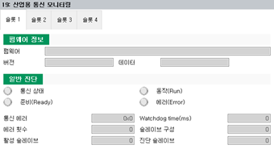

# 7.3.9.3 모니터링

산업용 통신에서 사용 설정된 펌웨어와 통신의 설정 정보 및 동작 상태를 모니터링합니다.

1.	\[**서비스**\] 버튼 &gt; \[19: 산업용 통신 모니터링\] 메뉴를 터치하십시오. 보드별 산업용 통신 모니터링 화면이 나타납니다.

2.	원하는 탭을 선택하여 펌웨어, 통신 장치 및 통신 구성의 상세 정보를 확인하십시오.


\[재시작\] 버튼을 이용하여 PCI 통신 카드의 산업용 통신을 다시 시작할 수 있습니다.


