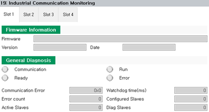

# 7.3.9.3 Monitoring

You can monitor the setting information and operation status of the firmware and communication the use of which you have set in the industrial communication menu.

1.	Touch \[service > 19: Industrial Communication Monitoring\] menu. Then the screen for monitoring the industrial communication of each board will appear.

2.	By selecting the desired tab, you can check the detailed information of the firmware, communication devices and communication configuration. 

    

 


You can restart the industrial communication of the PCI communication card by using the \[Restart\] button.


