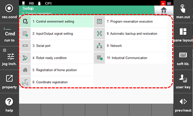

# 7.3 Control Parameter

You can set various conditions of the controller and set the input/output signal, communication information, robot ready OK signal condition, home position signal, and the coordinate system.

1.	Touch the \[2: Control parameter\] menu. Then, the control parameter menu will appear. 

2.	Select the desired menu and check and set various conditions of the controller.

    

