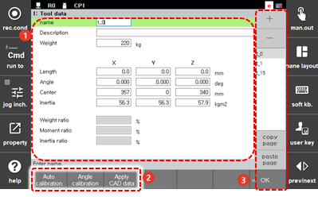
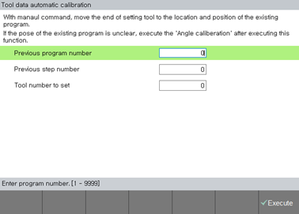
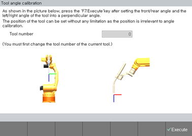

# 7.4.1.1 工具数据设置

根据机器人 R1 轴法兰手动设置 TCP 的距离和角度，并注册工具的重量、重心和惯性的方法如下。

1. 触摸 `[3: Robot Parameter - 1: Tool Data] ([3: Robot Parameter  - 1: Tool Data])` 菜单。

2. 设置工具数据名称、重量、每个轴的详细条件和允许比率。

    

<table>
  <thead>
    <tr>
      <th style="text-align:left">编号</th>
      <th style="text-align:left">描述</th>
    </tr>
  </thead>
  <tbody>
    <tr>
      <td style="text-align:left">
        
      </td>
      <td style="text-align:left"><ul>从工具数据列表中选择的工具数据的详细信息。
        您可以设置工具数据名称和描述、重量、每个轴的详细条件和允许比率。</ul></td>
    </tr>
    <tr>
      <td style="text-align:left">
        
      </td>
      <td style="text-align:left">
        <ul>
          <li><b>[自动校准]</b>: 您可以创建新的工具数据，也可以通过使用现有程序简单地创建工具数据。如果您想在之前教授的步骤位置重新进行设置，您应首先放置工具，然后执行自动校准功能以重新创建工具长度和角度。
             
            
             
          </li>
          <ul>
            <li>[前一程序编号]: 您可以输入在工具变形发生之前教授的程序编号。</li>
            <li>[前一步编号]: 您可以输入将要执行自动工具数据校准的步骤编号。</li>
            <li>[要设置的工具编号]: 您可以输入要新设置的工具编号。</li>
          </ul>
          <li>
            
[角度校准]: 您可以校准工具的角度。

            

              
            

          </li>
          <li>[应用 CAD 数据]: 如果您有工具的 CAD 数据并用它编辑工具数据，则这被视为负载估算的完成。
             
          </li>
        </ul>
      </td>
    </tr>
    <tr>
      <td style="text-align:left">
        
      </td>
      <td style="text-align:left">
        <ul>
          <li>[确定]: 您可以保存更改。</li>
          <li>[+]/[-]: 您可以添加新的工具数据或删除工具数据。</li>
          <li>工具数据列表。选择工具数据名称将允许您检查和编辑详细信息。</li>
          <li>[复制页面]/[粘贴页面]: 您可以复制工具数据信息，然后粘贴到另一个工具数据。
             在从列表中选择要复制的工具数据信息的名称并触摸<b>[复制页面]</b>按钮后，选择要应用数值的工具数据名称，然后触摸<b>[粘贴页面]</b>按钮。</li>
        </ul>
      </td>
    </tr>
  </tbody>
</table>


* 在工具数据列表中，未执行负载估算的工具数据将在名称的右侧标记为 \(X\)。
* 您必须在使用工具之前先执行负载估算。使用未执行负载估算的工具可能会导致机器人速度和耐用性的问题。
* 
  当工具数据被复制时，负载估算数据也将被复制。工具数据的复制和粘贴功能仅在已执行负载估算的工具编号的选项卡上执行。
