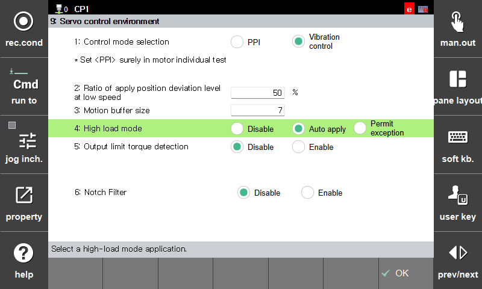
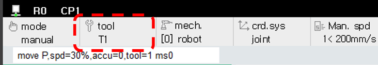
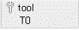
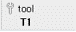

# 7.4.1.3 High Load Mode

The availability of High Load Mode may vary depending on the robot model. In general, high load mode is supported on medium-sized robots with a payload capacity of 100 kg or more.  For models that support high load mode, you can configure "4. High load mode" as shown in the figure below in `[F2: system] - 3: Robot Parameter - 33: Servo parameter - 9: Servo control environment` menu.  For models that support high load mode, auto apply is the default setting.

| Setting Value | Operating Characteristics |
| :--- | :--- |
|Disable| Operates in normal mode regardless of tool load.  - When the motor is turned ON, warning (W0051) is generated indicating risk of premature robot failure due to high load mode being "Disable".
|Auto apply| Operates in normal mode when the tool load is below the rated load.  When the load exceeds the rated value, it switches to high load mode, and the robot's operating speed and acceleration/deceleration are reduced.
|Permit exception| If the tool load is below the maximum allowable ratio for high load mode, it operates the same as auto apply.  If the high-load threshold is exceeded, it operates in high load exception mode.  -	When the motor is turned ON, warning (W00177) is generated indicating risk of premature robot failure due to high load "Permit exception" mode.

The high load mode application status based on the currently applied tool load can be checked as shown in the figure below. 

 : Nomal Mode (regular font)

 : **High Load Mode** (bold font)

 : High Load Exception Mode (red font)


The allowable ratio for high load mode may vary depending on the robot model and controller software version.

