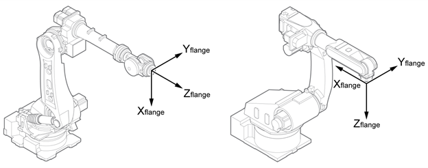
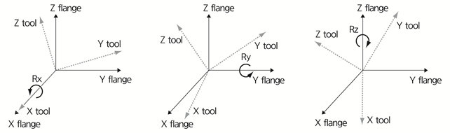

# 7.4.1    工具数据

您可以根据机器人的 R1 轴法兰设置 TCP 的距离和角度，并注册工具的重量、重心和惯性。您可以使用 `[1: Tool data]` 菜单手动进行注册。

另一种方法是使用自动校准功能设置工具长度，并使用负载估计功能注册工具的重量、重心和惯性。

在进行线性或圆形插补等插补操作时，轨迹将基于 TCP 创建，因此在教学之前应准确设置工具的长度和角度。

${cont_model} 控制器根据机器人的动力学执行控制。只有在正确设置工具的重量、中心和惯性时，机器人才能快速安全地操作。如果工具的重量、中心和惯性值不正确，可能会对机器人的性能和使用寿命造成严重问题。

特别是在使用工具更换功能时，所有与工具更换相关的工具信息，不仅是每个工具的信息，还有分配给断开工具的单独编号，均应输入以供使用。此外，即使在处理操作期间，工件的装卸状态也应分配给每个工具编号以供使用。

工具的长度是在法兰坐标系统中每个方向的长度。 \(X 轴方向长度: Xt / Y 轴方向长度: Yt / Z 轴方向长度: Zt\)

工具的角度是在法兰坐标系统中每个方向的姿态转换量。 \(X 轴方向角度: Rx / Y 轴方向角度: Ry / Z 轴方向角度: Rz\)

工具的长度和角度将基于法兰坐标系统进行设置。工具长度可以设置为从法兰坐标系统的中心到 TCP 的距离。

工具姿态是根据上述设置的工具角度，基于工具法兰坐标系统在 X、Y 和 Z 方向上依次进行旋转而获得的值。

Rxyz = Rot\(z, Rz\)Rot\(y, Ry\)Rot\(x, Rx\)

* Rxyz: 基于工具法兰的工具姿态旋转矩阵
* Rot\(z, Rz\): 在法兰坐标系统的 Z 轴方向上旋转 Rz 的旋转矩阵 
* Rot\(y, Ry\): 在法兰坐标系统的 Y 轴方向上旋转 Ry 的旋转矩阵
* Rot\(x, Rx\): 在法兰坐标系统的 X 轴方向上旋转 Rx 的旋转矩阵