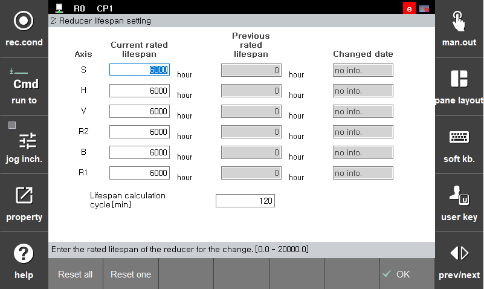

# 7.4.10 감속기 수명 설정

로봇축의 감속기가 교체된 경우 감속기 정격 수명을 초기화 합니다.
감속기는 동작 부하조건 및 속도에 따라 정격 수명이 소진되는 속도가 달라집니다. 고속 고부하 조건일수록 보다 빠른 속도로 수명이 감소하게 됩니다. 
시스템 특성데이터의 감속기 정격 수명 모니터링 에서는 로봇의 동작 상태를 모니터링 하여 감속기의 잔여 정격수명 및 최근 동작 패턴을 기반으로 예상 수명을 표시하고 있습니다.

정격 수명 : 정격부하 및 정격속도 조건하에서 지속적으로 구동 시 잔여 수명 
예상 수명 : 최근 구동 조건을 바탕으로 예상되는 잔여 수명으로 로봇의 최근 동작 패턴에 따라 예상 수명이 
&nbsp;&nbsp;&nbsp;&nbsp;&nbsp;&nbsp;&nbsp;&nbsp;&nbsp;&nbsp;&nbsp;&nbsp;&nbsp;&nbsp;&nbsp;&nbsp;&nbsp;&nbsp; 증가하거나 감소 할 수 있습니다. 

감속기 교체시 정격수명 초기화 방법
1.	\[3: 로봇 파라미터 &gt; 12: 감속기 수명 설정\] 메뉴를 터치하십시오.

2.	교체된 감속기에 해당하는 위치로 커서를 옮긴 후 \[**단일 초기화**\] 버튼을 터치하십시오.
만일 전체 감속기를 교체하였거나, 신규 로봇으로 본체를 교체한 경우에는 \[**전체 초기화**\] 버튼을 터치 하십시오. 정격 수명이 초기화 된 감속기의 경우 수정 일자 항목에 초기화 수행 일자가 기록 됩니다. 

수명 계산 주기 \[**분**\] : 감속기 정격 및 예상 수명의 갱신 주기 설정 최소 10분 단위로 설정 가능.


감속기 정격 수명 및 예상 수명은 감속기의 수명 계산 모델에 의해 계산된 예측 참고치 입니다. 실제 감속기의 수명은 구동환경에 따라 예상 모델과 차이가 있을 수 있습니다. 

