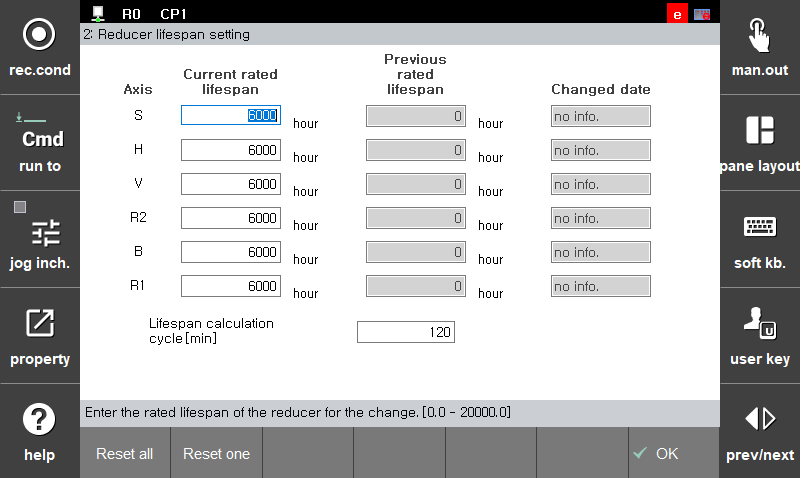

# 7.4.10 减速机使用寿命设置

如果机器人轴的减速机被更换，则应初始化减速机的额定使用寿命。
减速机额定使用寿命耗尽的速率取决于操作负载条件和速度。速度越高，负载越大，使用寿命下降得越快。
减速机寿命数据可以在系统特性数据中找到。
监控菜单显示减速机的剩余额定寿命和基于最新机器人操作模式的预期寿命。

额定寿命：在额定负载和额定速度条件下持续驱动时的剩余寿命 
预期寿命：根据最近实际驱动条件估算的剩余寿命。 
&nbsp;&nbsp;&nbsp;&nbsp;&nbsp;&nbsp;&nbsp;&nbsp;&nbsp;&nbsp;&nbsp;&nbsp;&nbsp;&nbsp;&nbsp;&nbsp;&nbsp;&nbsp;  寿命预期可能会因机器人最近的运动模式而增加或减少。

减速机使用寿命初始化
1.    触摸`[3: Robot parameter - 12: 系统维护 - 2:Reducer Lifespan setting] ([3: Robot parameter  - 12: System maintenance  - 2:Reducer Lifespan setting])`菜单。

2.    将光标移动到与更换的减速机相对应的位置并触摸`[Reset one]`按钮。
如果所有减速机都被更换或机身被更换为新机器人，请触摸`[Reset all]`按钮。在初始化额定寿命的减速机的情况下，初始化日期会记录在更改日期列中。

使用寿命计算周期`[min]`：减速机使用寿命的更新周期。最短周期为10分钟。


减速机的额定和预期寿命是基于减速机寿命预测模型的预测参考值。实际减速机的寿命可能会根据驾驶条件与预期模型有所不同。
