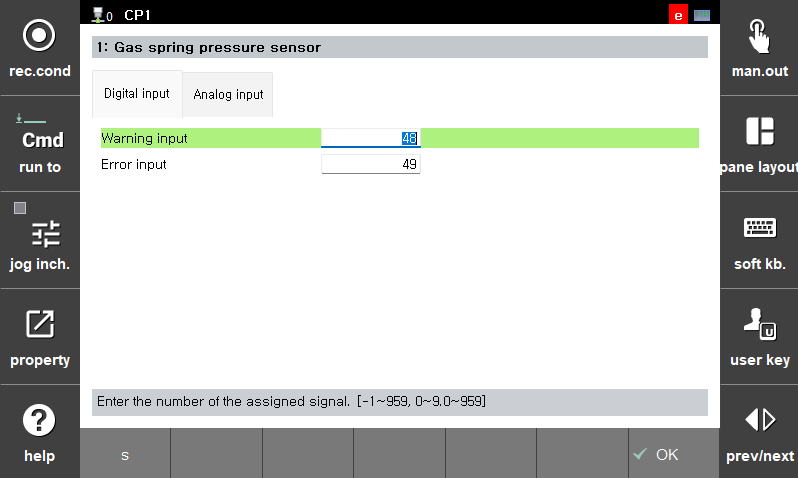
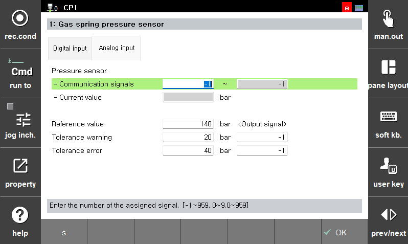

# 7.4.13.1 Gas spring pressure sensor

The gas spring pressure sensor function is used to detect abnormal pressure in the gas spring by constantly reading the value of the pressure sensor through analog input or to generate a warning or error through digital input in a robot that uses a gas spring and has a pressure sensor (PN2570) specified by our company attached to it.   

[Digital input]

<table>
  <thead>
    <tr>
      <th style="text-align:left">Item</th>
      <th style="text-align:left">Description</th>
    </tr>
  </thead>
  <tbody>
    <tr>
      <td style="text-align:left"> 
        Warning input
      </td>
      <td style="text-align:left">
        Sets the signal number to receive a warning. Pressure sensors can output a warning when the measured pressure exceeds a set tolerance. The controller generates W21020 when the set signal turns on. 
      </td>
    </tr>
    <tr>
      <td style="text-align:left"> 
        Error input
      </td>
      <td style="text-align:left">
        Sets the signal number to receive a warning. Pressure sensors can output a warning when the measured pressure exceeds a set tolerance. The controller generates E21020 when the set signal turns on. 
      </td>
    </tr>
  </tbody>
</table>

 

[Analog input]

<table>
  <thead>
    <tr>
      <th style="text-align:left">Item</th>
      <th style="text-align:left">Description</th>
    </tr>
  </thead>
  <tbody>
    <tr>
      <td style="text-align:left">
        Communication signals
      </td>
      <td style="text-align:left">
        Sets the digital signal into which the pressure sensor value is input.
      </td>
    </tr>
    <tr>
      <td style="text-align:left"> 
        Current value
      </td>
      <td style="text-align:left">
        The pressure value measured by the pressure sensor is displayed.
      </td>
    </tr>
    <tr>
      <td style="text-align:left"> 
        Reference value
      </td>
      <td style="text-align:left">
        Sets the reference pressure injected into the gas spring. 
      </td>
    </tr>
    <tr>
      <td style="text-align:left"> 
        Tolerance warning and output signal
      </td>
      <td style="text-align:left">
        A warning (W21018 or W21019) is generated when the measured pressure deviates from the set tolerance from the reference pressure.  
        If an output signal is set, the signal output is turned on. 
      </td>
    </tr>
    <tr>
      <td style="text-align:left"> 
        Tolerance error and output signal
      </td>
      <td style="text-align:left">
        An error (E21018 or E21019) occurs when the measured pressure is outside the tolerance set from the reference pressure.  
        If an output signal is set, the signal output is turned on.  
      </td>
    </tr>
  </tbody>
</table>

 


* This feature is supported in versions V60.30.07 and later.   

