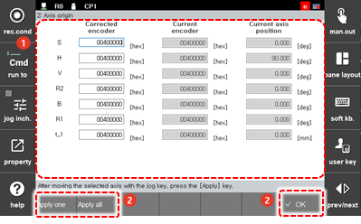

# 7.4.2 轴原点

您可以注册每个轴的机械原点位置。

1. 触摸 `[3: Robot Parameter - 2: Axis Origin] ([3: Robot Parameter  - 2: Axis Origin])` 菜单。

2. 注册每个轴的机械原点位置。

    

<table>
  <thead>
    <tr>
      <th style="text-align:left">编号</th>
      <th style="text-align:left">描述</th>
    </tr>
  </thead>
  <tbody>
    <tr>
      <td style="text-align:left">
        
      </td>
      <td style="text-align:left">
        
每个轴的机械原点位置的详细信息。您可以设置轴的编码器和位置。

        <ul>
          <li>S轴：您可以根据机器人和周围夹具的安装情况更改S轴原点。</li>
          <li>R1轴：您可以根据工具附件方向更改R1轴的原点。</li>
          <li>H、V、R2和B轴：可以通过自动校准功能自动设置。</li>
        </ul>
      </td>
    </tr>
    <tr>
      <td style="text-align:left">
        
      </td>
      <td style="text-align:left">
        <ul>
          <li>[确认]：您可以保存更改。</li>
          <li>[应用一个]：您可以将选定的原点位置应用于选定的轴信息。</li>
          <li>[应用全部]：您可以将选定的原点位置应用于所有轴信息。</li>
        </ul>
      </td>
    </tr>
  </tbody>
</table>


* 轴原点设置会影响机器人的笛卡尔操作精度。尽可能将其更改为准确的值。
* 
  如果更改轴原点设置，则之前创建的程序位置将会改变。因此，轴原点设置必须仅在初始安装阶段执行。

* 
  如果更改编码器偏移设置，则应重新设置轴原点。因此，编码器偏移设置必须在轴原点设置之前完成。



发货时，每个轴的机械原点位置设置为标准值 \(0X400000\)。
