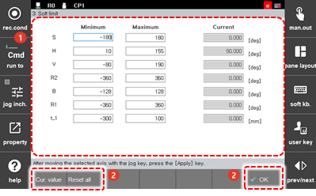

# 7.4.3 Soft Limit

You can adjust the operation range of each axis according to the robot’s use environment.

1.	Touch the \[3: Robot Parameter &gt; 3. Soft Limit\] menu.

2.	Set the operation range of each axis.

    

<table>
  <thead>
    <tr>
      <th style="text-align:left">No.</th>
      <th style="text-align:left">Description</th>
    </tr>
  </thead>
  <tbody>
    <tr>
      <td style="text-align:left">
        
      </td>
      <td style="text-align:left">Detailed information on the operation range of each axis. You can set
        the minimum and maximum operation ranges of an axis and the current axis
        position.</td>
    </tr>
    <tr>
      <td style="text-align:left">
        
      </td>
      <td style="text-align:left">
        <ul>
          <li>[OK]: You can save the changes.</li>
          <li>[Cur. Value]: You can set the operation range of each axis based on the
            current robot position.</li>
          <li>[Reset All]: You can initialize the operation range of all axes.</li>
        </ul>
      </td>
    </tr>
  </tbody>
</table>


At the time of the shipping from the factory, the operation range of each axis of the robot is set to a maximum. 


