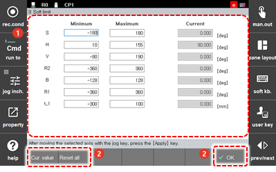

# 7.4.3 软件限制

您可以根据机器人的使用环境调整每个轴的操作范围。

1. 触摸 `3: Robot Parameter - 3. Soft Limit (3: Robot Parameter  - 3. Soft Limit)` 菜单。

2. 设置每个轴的操作范围。

    

<table>
  <thead>
    <tr>
      <th style="text-align:left">编号</th>
      <th style="text-align:left">描述</th>
    </tr>
  </thead>
  <tbody>
    <tr>
      <td style="text-align:left">
        
      </td>
      <td style="text-align:left">每个轴的操作范围的详细信息。您可以设置一个轴的最小和最大操作范围以及当前轴的位置。</td>
    </tr>
    <tr>
      <td style="text-align:left">
        
      </td>
      <td style="text-align:left">
        <ul>
          <li>[确认]: 您可以保存更改。</li>
          <li>[当前值]: 您可以基于当前机器人位置设置每个轴的操作范围。</li>
          <li>[重置全部]: 您可以初始化所有轴的操作范围。</li>
        </ul>
      </td>
    </tr>
  </tbody>
</table>


在出厂时，机器人每个轴的操作范围设置为最大值。 
