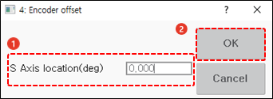

# 7.4.4.1 编码器偏移值的利用

为了在当前工作程序备份并初始化系统后继续使用现有程序，机器人必须保持初始化前存在的参考位置信息。如果记录编码器偏移值，机器人之前的位置信息可以被检索。

系统初始化后，直接输入编码器偏移值为十六进制值。如果使用软键盘输入该值会更加方便。

如果编码器偏移值以轴位置值 \(mm 或度\) 记录，需要在按下 `[SHIFT]` 键的同时触摸 `[Reset One]` 按钮时，输入窗口中输入轴位置值。


轴位置输入窗口中的基本设置值是参考位置值。如果不输入轴位置值就保存，当前编码器位置将被设置为原点位置 \(0X400000\)。
