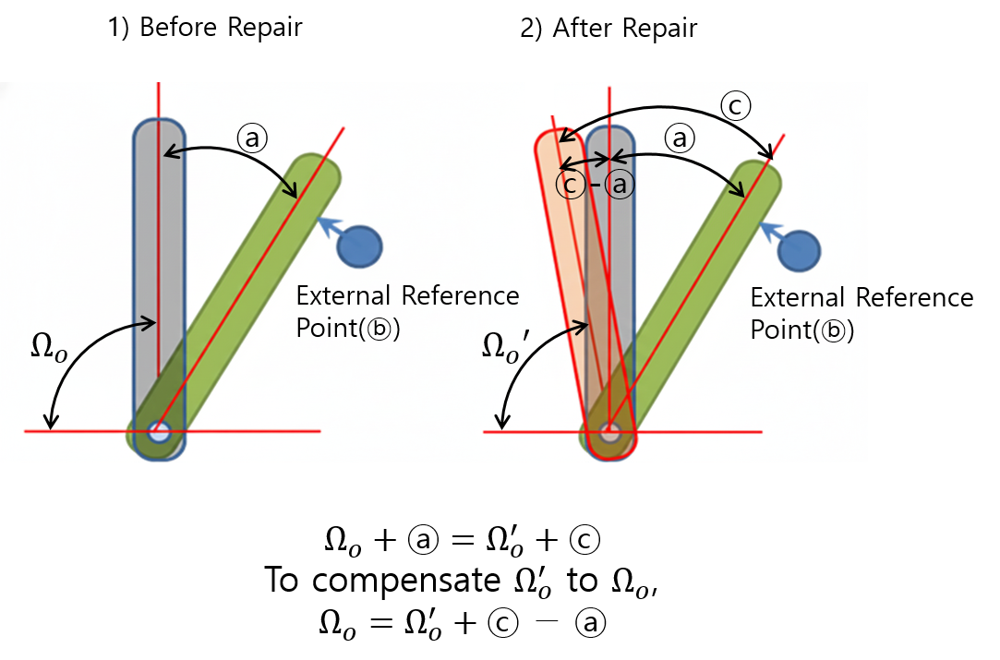
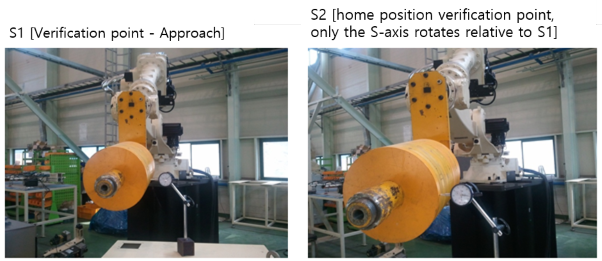
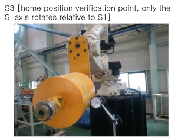
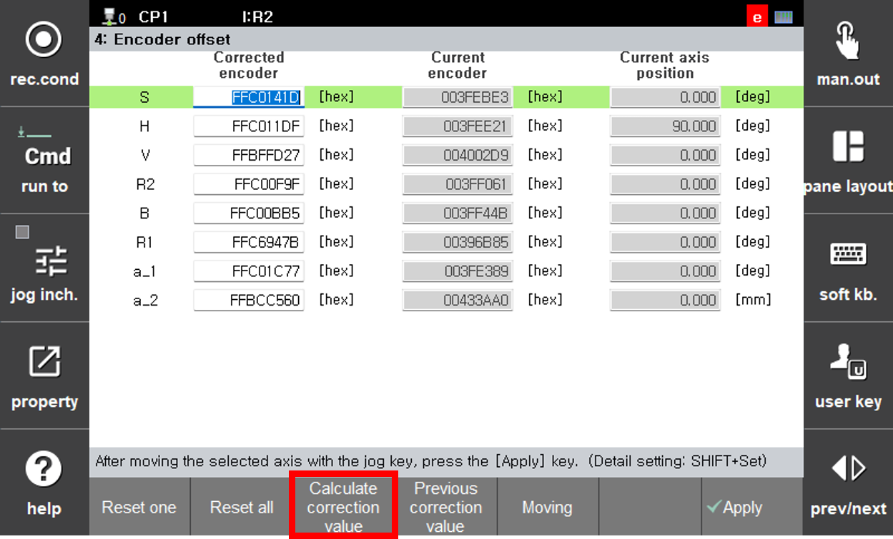
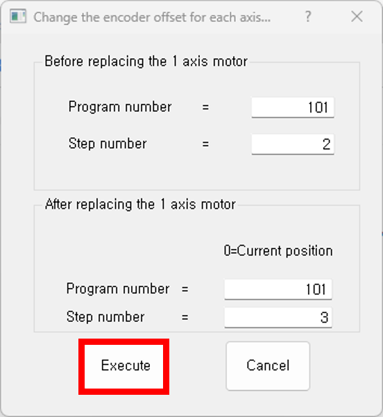
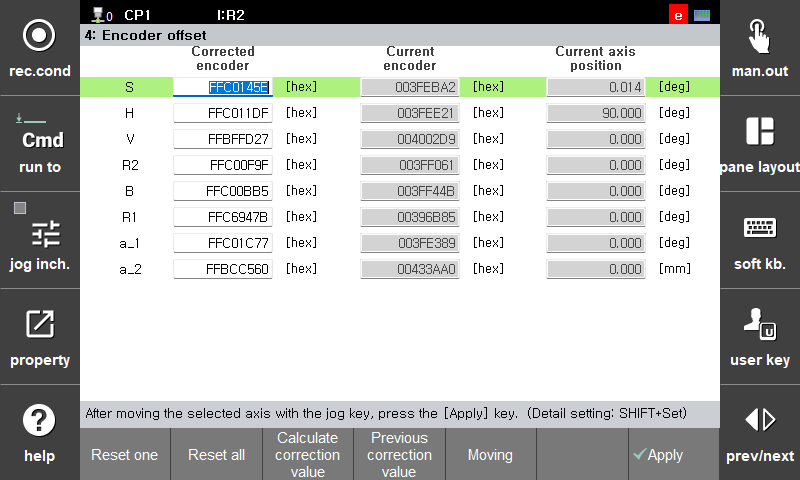

# 7.4.4.2 Axis Home Position Restoration

When a component failure occurs in the robot mechanism (especially the motor or reducer) and the component is replaced, the encoder must be calibrated under the same conditions as the original home position in order to restart the existing teaching program.  
However, when service personnel perform this procedure manually on site, the home position may be set through multiple trials and errors. This dedicated function is provided to simplify that process.

※ What is home position restoration after mechanical repair?

In other words, home position restoration refers to:  
Using an external reference point (dial gauge), after replacing a component, compensating the inaccurately calibrated home position Ωo′ by the value ⓒ − ⓐ to restore it to the accurate home position Ωo.  
(This is required to reuse the teaching program.)


The position of the external reference point (ⓑ) must not change before and after component replacement. In other words, it must be exactly the same location both before and after replacement.


### Example

The following example explains the function assuming that the S-axis motor is replaced.

1. Assign a new program (101.job), and teach S1 [verification point – Approach] and S2 [home position verification point, only the S-axis rotates relative to S1] so that a fixed point on the firmly mounted tool approaches a jig or peripheral device.  

   

2. After replacing the S-axis motor, manually jog the S-axis to a position close to the encoder calibration position before replacement, then perform encoder calibration for the S-axis on the **System / Robot Parameter / Encoder Calibration** screen.

3. Manually run the taught program (101.job) to move to S1, then move to S2. When the position becomes identical to that before the mechanical component replacement, teach S3 [home position verification point, only the S-axis rotates relative to S1].  

   

4. Automatically calculate the encoder calibration value for the S-axis.

   1) Enter the **System / Robot Parameter / Encoder Calibration** screen.  
   2) Move the cursor to the S-axis and press **[F3: Calculate Calibration Value]**.  

      

   3) Set the program number to 101 and the step number to 2 for “Before S-axis motor replacement,”  
      and set the program number to 101 and the step number to 3 for “After S-axis motor replacement,”  
      then press the **[Execute]** button.  

      (※ If the program or step number for “After S-axis motor replacement” is set to 0, the encoder calibration value is calculated using the current S-axis position of the robot.)  

      

   4) The calculated encoder calibration value for the S-axis is displayed on the screen. Press **[F7: Confirm]** to apply the calibrated encoder value.  

      

5. Move to S2 of the taught program (101.job) and verify that the position is identical to that before the motor replacement.