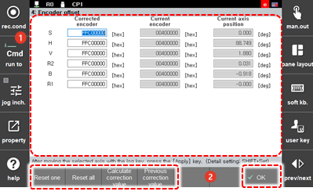

# 7.4.4 Encoder Offset

The current encoder position can be set as the encoder origin position \(position 0X400000\). You can determine the encoder origin at the reference position of each axis of the robot \(the position where the scale of each axis is attached\).

1.	Touch the \[3: Robot Parameter &gt; 4: Encoder Offset\] menu.

2.	Set the encoder offset value by adjusting the position of each axis. The encoder offset value will be recorded as a hex value \(a hexadecimal number\).

    

<table>
  <thead>
    <tr>
      <th style="text-align:left">No.</th>
      <th style="text-align:left">Description</th>
    </tr>
  </thead>
  <tbody>
    <tr>
      <td style="text-align:left">
        
      </td>
      <td style="text-align:left">Detailed information on the encoder offset value of each axis. You can
        set the calibrated encoder value, current encoder value, and current position
        of an axis.</td>
    </tr>
    <tr>
      <td style="text-align:left">
        
      </td>
      <td style="text-align:left">
        <ul>
          <li>[OK]: You can save the changes.</li>
          <li>[Reset One]/[Reset All]: You can initialize the encoder offset value of
            the selected or every axis.</li>
          <li>[Calculate Correction Value]: You can calibrate the encoder offset value
            of the selected axis.</li>
          <li>[Previous Correction Value]: You can retrieve the encoder offset value
            that existed prior to the calibration of the selected axis.</li>
        </ul>
      </td>
    </tr>
  </tbody>
</table>


The encoder offset value is set at the time of the shipping from the factory. Resetting the encoder offset value should be performed only when necessary, such as replacing the motor or encoder.


