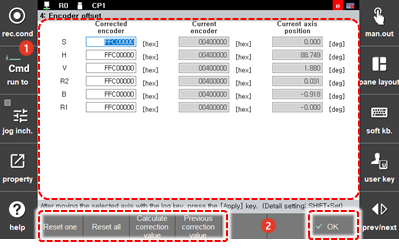

# 7.4.4 编码器偏移

当前的编码器位置可以设置为编码器原点位置 \(position 0X400000\)。您可以在机器人每个轴的参考位置确定编码器原点 \(每个轴附加刻度的位置\)。

1. 触摸 `[3: Robot Parameter - 4: Encoder Offset] ([3: Robot Parameter  - 4: Encoder Offset])` 菜单。

2. 通过调整每个轴的位置设置编码器偏移值。编码器偏移值将记录为十六进制值 \(一个十六进制数字\)。

    

<table>
  <thead>
    <tr>
      <th style="text-align:left">编号</th>
      <th style="text-align:left">描述</th>
    </tr>
  </thead>
  <tbody>
    <tr>
      <td style="text-align:left">
        
      </td>
      <td style="text-align:left">每个轴的编码器偏移值的详细信息。您可以
        设置校准的编码器值、当前编码器值和轴的当前位置。</td>
    </tr>
    <tr>
      <td style="text-align:left">
        
      </td>
      <td style="text-align:left">
        <ul>
          <li>[确定]: 您可以保存更改。</li>
          <li>[重置单个]/[重置所有]: 您可以初始化选定或所有轴的编码器偏移值。</li>
          <li>[计算修正值]: 您可以校准选定轴的编码器偏移值。</li>
          <li>[先前修正值]: 您可以恢复在所有轴校准之前存在的编码器偏移值。</li>
          <li>[机器人移动]: 点击 [机器人移动] 按钮将机器人移动到记录的步骤位置（Jog）。</li>
        </ul>
      </td>
    </tr>
  </tbody>
</table>


编码器偏移值在出厂时设置。只有在必要时，例如更换电机或编码器时，才应重置编码器偏移值。
