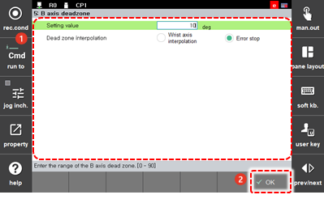

# 7.4.5 B轴死区

在B轴的0度附近，R1轴的旋转中心和R2轴的旋转中心轴几乎是平行的。当机器人执行线性插补或圆形插补等插补时，手腕轴即使在小范围运动中也会快速移动。

设置B轴不使用区域。

1.	触摸`[3: Robot Parameter - 5: B-axis Deadzone] ([3: Robot Parameter  - 5: B-axis Deadzone])`菜单。

2.	在设置确定不使用区域的角度和插补处理模式后，触摸`[OK]`按钮。

    

* `[Setting Value]`: 您可以输入确定B轴不使用区域的角度。
* 
  `[Dead zone interpolation]`: 当机器人轨迹在插补操作中必须经过B轴不使用区域时，您可以进行有关错误处理和机器人停止的设置。