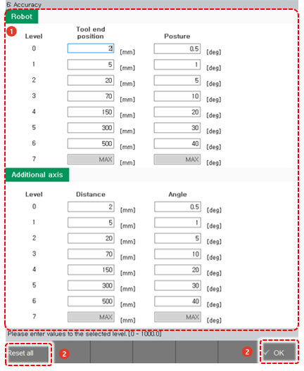

# 7.4.6 精度

您可以设置精度级别的详细条件，指的是机器人在执行目标步骤时通过该步骤的精度。

1. 触摸 `[3: Robot Parameter - 6: Accuracy] ([3: Robot Parameter  - 6: Accuracy])` 菜单。

2. 为每个精度级别设置工具提示位置 \(TCP\) 和姿态。

    

<table>
  <thead>
    <tr>
      <th style="text-align:left">编号</th>
      <th style="text-align:left">描述</th>
    </tr>
  </thead>
  <tbody>
    <tr>
      <td style="text-align:left">
        
      </td>
      <td style="text-align:left">
        
每个级别的详细信息。您可以为每个精度级别设置工具提示位置 (TCP) 和姿态。

        <ul>
          <li>精度级别可以设置为从 0 到 7 的值，精度级别将被记录为步骤语句参数之一。</li>
          <li>精度级别 0&#x2013;6: 输入每个级别的 TCP 距离和姿态，以及附加轴的距离和角度。 对于不支持线性或圆形插补的机器人，例如 LCD 机器人，将应用与附加轴相同的方法。</li>
          <li>精度级别 7: 值将自动计算并显示在控制器中，因此您不需要直接输入该值。 当应用精度级别 7 时，将创建满足步骤距离 1/2 的条件的最大转弯路径。精度级别 7 在需要使机器人尽可能平滑和快速移动的情况下非常有用，例如 LDC 手进出操作。</li>
        </ul>
      </td>
    </tr>
    <tr>
      <td style="text-align:left">
        
      </td>
      <td style="text-align:left">
        <ul>
          <li>[确定]: 您可以保存更改。</li>
          <li>[重置所有]: 您可以初始化所有精度级别的 TCP 距离和姿态。</li>
        </ul>
      </td>
    </tr>
  </tbody>
</table>


* 如果您根据对 "[2.3 步骤](../../2-operation/3-step/README.md)" 内容的理解来接近精度级别，您可以更轻松地使用它。
* 在使用伺服枪或无均衡器枪的焊接步骤中，控制器将自动根据设置的精度级别执行限制。 

