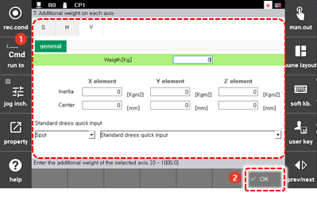

# 7.4.7 每个轴的附加重量

您可以注册安装在机器人基本轴上的变压器或电缆支架的信息。

1. 触摸`[3: Robot Parameter - 7: Additional Weight on Each Axis] ([3: Robot Parameter  - 7: Additional Weight on Each Axis])`菜单。

2. 选择基本轴选项卡，设置安装的附加重量的信息，然后触摸`[OK]`按钮。

    


如果机器人因为安装了变压器或电缆支架而有附加重量，则必须注册每个轴的附加重量的信息。如果附加重量未正确注册，在执行工具负载估算时错误可能会增大。
