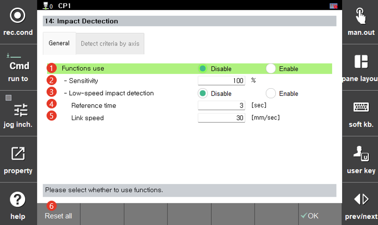
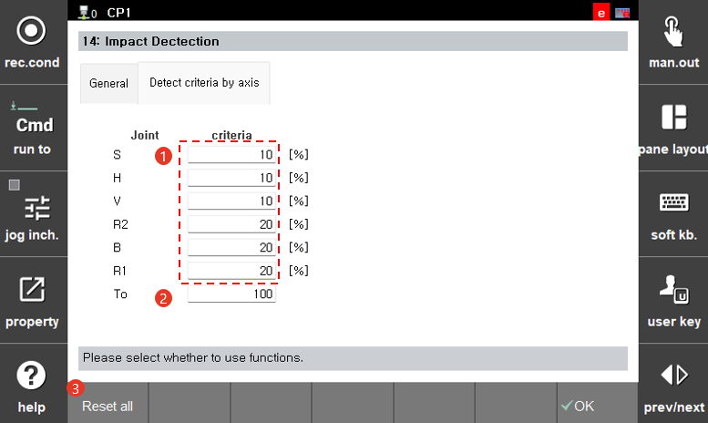

# 7.4.8.1 基于模型的碰撞检测

基于模型的碰撞检测功能通过计算在机器人运动过程中应正常产生的扭矩与实际测量的扭矩之间的差异来检测碰撞。可以调整灵敏度以控制对碰撞的响应，并且在机器人以低速移动时与外部物体的接触也可以被检测到。

1. 触摸菜单 `[3: Robot parameter - 14: Impact Detection - 1: Model-Based Collision Detection] ([3: Robot parameter  - 14: Impact Detection  - 1: Model-Based Collision Detection])`。

<table>
  <thead>
    <tr>
      <th style="text-align:left">编号</th>
      <th style="text-align:left">描述</th>
    </tr>
  </thead>
  <tbody>
    <tr>
      <td style="text-align:left">
        
      </td>
      <td style="text-align:left">启用或禁用基于模型的碰撞检测功能。</td>
    </tr>
    <tr>
      <td style="text-align:left"> 
        
      </td>
      <td style="text-align:left">表示所有轴的默认灵敏度。较高的值会增加碰撞检测灵敏度。 (默认: 100, 最大: 200)  </td>
    </tr>
    <tr>
      <td style="text-align:left"> 
        
      </td>
      <td style="text-align:left">启用或禁用低速碰撞检测功能。</td>
    </tr>
    <tr>
      <td style="text-align:left"> 
        
      </td>
      <td style="text-align:left">检测低速碰撞的设置时间。如果碰撞力施加超过这个参考时间，则被识别为碰撞。</td>
    </tr>
    <tr>
      <td style="text-align:left"> 
        
      </td>
      <td style="text-align:left">只有当链节速度低于设置值时，碰撞才被视为低速碰撞。</td>
    </tr>
    <tr>
      <td style="text-align:left"> 
        
      </td>
      <td style="text-align:left">将设置重置为默认值。</td>
    </tr>
  </tbody>
</table>


每轴设置标签仅在工程模式或更高模式中启用。


<table>
  <thead>
    <tr>
      <th style="text-align:left">编号</th>
      <th style="text-align:left">描述</th>
    </tr>
  </thead>
  <tbody>
    <tr>
      <td style="text-align:left">
        
      </td>
      <td style="text-align:left">相对于每个轴的碰撞检测阈值的比例（%）。较低的值会导致更灵敏的响应。</td>
    </tr>
    <tr>
      <td style="text-align:left"> 
        
      </td>
      <td style="text-align:left">截止频率值，通常根据机器人的控制环境设置。如果任何轴设置为0，则禁用该轴的碰撞检测。（最大值：100） </td>
    </tr>
    <tr>
      <td style="text-align:left"> 
        
      </td>
      <td style="text-align:left">将设置重置为默认值。</td>
    </tr>
  </tbody>
</table>


每个轴的最终灵敏度值与每轴灵敏度值成正比，与所有轴的整体默认灵敏度成反比。
