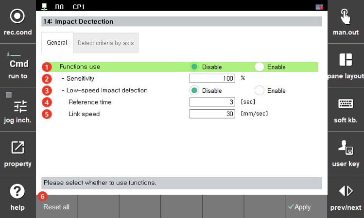
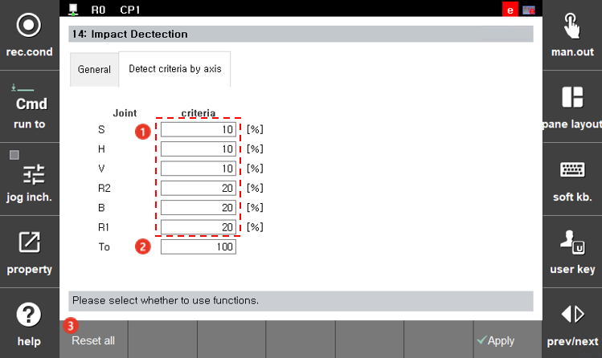

# 7.4.8.1 모델기반 충돌검지

모델기반 충돌검지 기능은 로봇이 동작 중에 정상적으로 발생해야 하는 토크와 실제 측정되는 토크의 차이를 로봇의 동역학 모델을 기반으로 계산하여 충돌을 검지합니다. 민감도를 설정하여 충돌에 대한 반응성을 조절할 수 있으며, 로봇이 저속으로 움직일 때에 발생하는 외부와의 접촉에 대해서도 검지 가능합니다. 

1. \[3: 로봇 파라미터 &gt; 14: 충돌 검지 &gt; 1: 모델 기반 충돌 검지\] 메뉴를 터치하십시오.

<table>
  <thead>
    <tr>
      <th style="text-align:left">번호</th>
      <th style="text-align:left">설명</th>
    </tr>
  </thead>
  <tbody>
    <tr>
      <td style="text-align:left">
        
      </td>
      <td style="text-align:left">모델 기반 충돌 검지 기능 사용 유무를 설정합니다.</td>
    </tr>
    <tr>
      <td style="text-align:left"> 
        
      </td>
      <td style="text-align:left">축 전체 기본 민감도를 의미하며 값이 높을수록 민감하게 충돌음 감지하게 됩니다.
      (기본값:100, 최대값:200)  </td>
    </tr>
    <tr>
      <td style="text-align:left"> 
        
      </td>
      <td style="text-align:left">저속 충돌검지 기능 사용 유무를 설정 합니다. </td>
    </tr>
    <tr>
      <td style="text-align:left"> 
        
      </td>
      <td style="text-align:left">저속 충돌을 검지하기 위한 설정 시간으로, 이 기준 시간 이상으로 충돌이 가해지면 충돌로 인식합니다. </td>
    </tr>
    <tr>
      <td style="text-align:left"> 
        
      </td>
      <td style="text-align:left">링크 속도가 설정값 보다 작을 때에만 저속 충돌로 판단합니다. </td>
    </tr>
    <tr>
      <td style="text-align:left"> 
        
      </td>
      <td style="text-align:left">기본 설정값으로 초기화 합니다.</td>
    </tr>
  </tbody>
</table>


축별 설정 탭은 엔지니어링 모드 이상에서만 활성화 됩니다. 


<table>
  <thead>
    <tr>
      <th style="text-align:left">번호</th>
      <th style="text-align:left">설명</th>
    </tr>
  </thead>
  <tbody>
    <tr>
      <td style="text-align:left">
        
      </td>
      <td style="text-align:left">축별 검지 기준값 대비 비율(%)로서 값이 낮을 수록 민감하게 반응합니다. </td>
    </tr>
    <tr>
      <td style="text-align:left"> 
        
      </td>
      <td style="text-align:left">차단 주파수 값으로 일반적으로 로봇의 제어 환경값으로 설정됩니다. 임의의 축을 0으로 설정하면, 해당 축은 충돌 검지 기능이 비활성화 됩니다.(최대값:100) </td>
    </tr>
    <tr>
      <td style="text-align:left"> 
        
      </td>
      <td style="text-align:left">기본 설정값으로 초기화 합니다.</td>
    </tr>
  </tbody>
</table>


축 별 최종 민감도값은 축별 민감도 값에 비례하고, 축 전체 기본 민감도와 반비례 합니다.    

