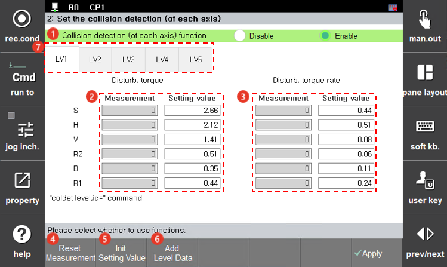

# 7.4.8.2 충돌검지 (축별) 설정

충돌검지 기능은 로봇 각축에 발생하는 외란토크와 외란토크의 변화율을 감시하여 측정된 값이 설정치를 초과할 때 에러로 처리 합니다. 

* 외란토크가 설정치를 초과하면 \[E0160 (O축)충돌 검지\]
* 외란토크 변화율이 설정치를 초과하면 \[E0161 (O축)충격 검지\] 로 표시합니다. 

<table>
  <thead>
    <tr>
      <th style="text-align:left">번호</th>
      <th style="text-align:left">설명</th>
    </tr>
  </thead>
  <tbody>
    <tr>
      <td style="text-align:left">
        
      </td>
      <td style="text-align:left">축별 충돌 검지 기능 사용 유무를 설정합니다. 유효인 상태라도 로봇 정지 상태이거나 스폿 GUN 가압 중에는 기능이 동작하지 않습니다.</td>
    </tr>
    <tr>
      <td style="text-align:left"> 
        
      </td>
      <td style="text-align:left"> [측정값] 충돌검지(coldet level.id) 명령이 유효한 구간에서 발생한 "외란토크" 최대값을 표시합니다. [설정값] 사용자는 이 값을 참고하여 각 레벨의 충돌검지를 위한 "외란토크" 값으로 설정 가능합니다. </td>
      </tr>
    <tr>
      <td style="text-align:left"> 
        
      </td>
      <td style="text-align:left">[측정값] 충돌검지(coldet level.id) 명령이 유효한 구간에서 발생한 "외란토크 변화율" 최대값을 표시합니다. [설정값] 사용자는 이 값을 참고하여 각 레벨의 충돌검지를 위한 "외란토크 변화율" 값으로 설정 가능합니다. </td>
    </tr>
    <tr>
      <td style="text-align:left"> 
        
      </td>
      <td style="text-align:left">각 축의 외란토크와 외란토크 변화율의 측정치(최대값)을 다시 측정하게 됩니다. </td>
    </tr>
    <tr>
      <td style="text-align:left"> 
        
      </td>
      <td style="text-align:left">각 축에 설정된 레벨값 전체를 초기값으로 설정하고하 할 때 사용합니다. </td>
    </tr>
    <tr>
      <td style="text-align:left"> 
        
      </td>
      <td style="text-align:left">레벨을 더 추가 하고자 할때 사용합니다. 설정할 수 있는 최대 레벨의 개수는 16개 입니다.</td>
    </tr>
  </tbody>
</table>
