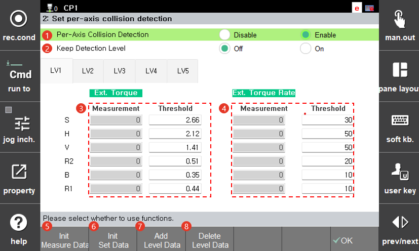

# 7.4.8.2 Set per-Axis Collision Detection

The collision detection function monitors the disturbance torque and the rate of change of the disturbance torque occurring on each robot axis. If the measured values exceed the configured thresholds, they are treated as errors.

* If the disturbance torque exceeds the set threshold, `[E0160 (Axis O) collision detected]` is displayed.
* If the disturbance torque rate exceeds the set threshold, `[E0161 (Axis O) shock detected]` is displayed.

<table>
  <thead>
    <tr>
      <th style="text-align:left">No.</th>
      <th style="text-align:left">Description</th>
    </tr>
  </thead>
  <tbody>
    <tr>
      <td style="text-align:left">
        
      </td>
      <td style="text-align:left">Enables or disables the per-axis collision detection function. Even when enabled, the function does not operate while the robot is stopped or while the spot gun is applying pressure.</td>
    </tr>
    <tr>
      <td style="text-align:left"> 
        
      </td>
      <td style="text-align:left">Sets whether to maintain sensitivity after a collision. When enabled, the current detection level is maintained even after a collision is detected.</td>
    </tr>
    <tr>
      <td style="text-align:left"> 
        
      </td>
      <td style="text-align:left"> 
        
[Measurement] Displays the maximum "disturbance torque" that occurred during the period when the collision detection command (coldet level.id) was active.

        
[Threshold] The user can refer to this value to configure the "disturbance torque" threshold for collision detection at each level. 

      </td>
    </tr>
    <tr>
      <td style="text-align:left"> 
        
      </td>
      <td style="text-align:left">
        
[Measurement] Displays the maximum "rate of change of disturbance torque" that occurred during the period when the collision detection command (coldet level.id) was active.

        
[Threshold] The user can refer to this value to configure the "rate of change of disturbance torque" threshold for collision detection at each level.

      </td>
    </tr>
    <tr>
      <td style="text-align:left"> 
        
      </td>
      <td style="text-align:left">Re-measures the maximum measured values of disturbance torque and rate of change of disturbance torque for each axis. </td>
    </tr>
    <tr>
      <td style="text-align:left"> 
        
      </td>
      <td style="text-align:left">Used to reset all level values configured for each axis to their default values. </td>
    </tr>
    <tr>
      <td style="text-align:left"> 
        
      </td>
      <td style="text-align:left">Used to add additional levels. The maximum number of configurable levels is 16.</td>
    </tr>
    <tr>
      <td style="text-align:left"> 
        
      </td>
      <td style="text-align:left">Used to delete the highest level. Deletion is possible starting from Level 6 and above. </td>
    </tr>
  </tbody>
</table>


Collision detection measured values are displayed for up to a maximum of 2 minutes.
