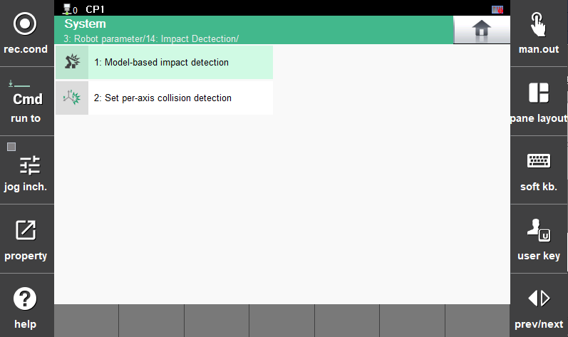

# 7.4.8 Impact Detection

When a collision occurs during robot operation, impact detection(collision detection) is a function that compares the torque normally generated during robot motion with the currently generated torque, and treats it as an error when abnormal torque is detected, in order to minimize damage caused by the collision

${cont_model} controller enhances robot safety by using the collision detection function in a complementary manner with existing safety functions—such as overcurrent, overload, overspeed, and position deviation error detection—when the robot operates under abnormal conditions or exhibits abnormal behavior.

Touch \[3: Robot Parameter &gt; 14: Impact Detection\] to use this function.


* The collision detection function operates only when the motor is ON.
* Be sure to set the correct tool/additional weight or perform load estimation before using the collision detection function.
* If the tool weight or additional weight for each axis differs from the actual values, false detections may occur.
* Collisions are not detected while performing load estimation or sensor-based / sensorless force control functions.
* Collisions with positioners, spot welders, jigs, or other equipment not mounted on the robot cannot be detected.
* Model-based collision detection is not supported for custom-made robot models.
* When collision detection error occurs after switching from autonomous driving mode to manual driving mode , this phenomenon is not an error (collision detection setting values need to be checked).



