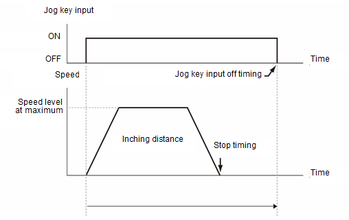
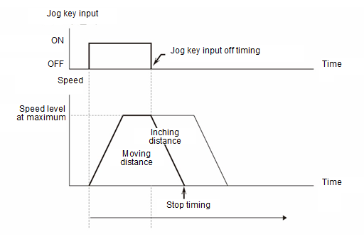

# 7.4.9.2 碰触 jog 操作

碰触功能是不允许移动超过每次按下 jog 键的最大移动距离的功能。

即使在达到碰触距离后，如果您继续按下 jog 键，然后松开手，机器人将减速到碰触距离，然后停止。

如果您在达到碰触距离之前释放 jog 键，机器人将从您释放 jog 键的时刻开始减速，然后停止。此时，模式将与一般 jog 模式相同。


在关节坐标系统中，速度级别 1 固定为机器人将移动 1 个编码器位的模式。
