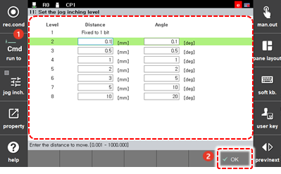

# 7.4.9 Jog Inching Level Setting

您可以通过指定移动距离来限制操作。这在您希望在手动模式下使用 jog 按钮将机器人移动到所需距离时非常有用。

1. 触摸`[3: Robot Parameter - 11: Set the Jog Inching Level] ([3: Robot Parameter  - 11: Set the Jog Inching Level])`菜单。

2. 设置每个 jog inching level 的距离和角度后，触摸`[OK]`按钮。

    