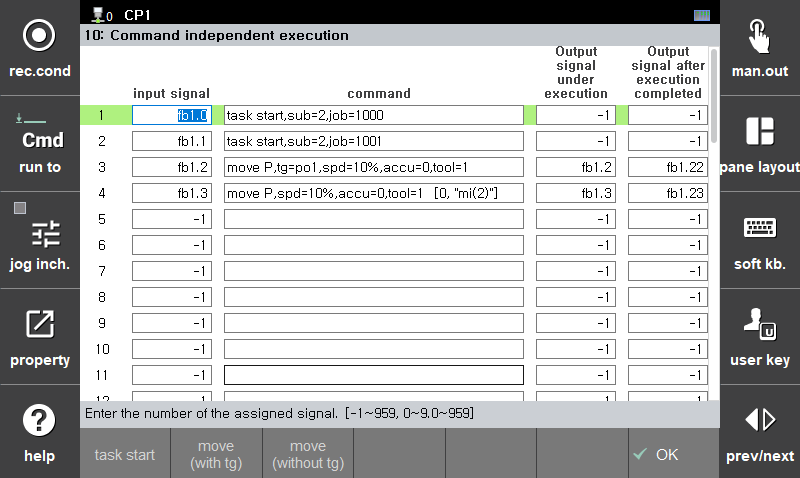

# 7.5.10 命令独立执行

这是一个在设定输入信号从 OFF 转为 ON 时，独立于工作程序执行相应语句的功能。  
该语句采用未使用的子任务执行，通常使用子任务 1。  
有关多任务的更多信息，请参见 "[${cont_model} 控制器功能手册 - 多任务](https://hrbook-hrc.web.app/#/view/doc-multi-task/zh/README)"。

  * 输入信号：设置信号输入到控制器。
  * 命令： 
    * 记录在输入信号从 OFF 变为 ON 时要执行的语句。 
    * 通常，任务启动用于静态伺服枪的枪搜索和尖端装饰工作，移动用于位置器的独立操作。 
    * 使用任务启动时，子任务 1 用于执行该命令，因此请指定子任务为 2 或更多，或设置为 0。 (0=自动分配)
  * 执行中的输出信号： 
    * 当语句执行开始时，它会被打开，当执行完成时会被关闭。 
    * 如果语句不是移动，则由于执行时间非常短而无意义。
  * 执行完成后的输出信号： 
    * 当对应语句的执行开始时变为 OFF，当执行完成时变为 ON。 
    * 如果语句不是移动，则由于执行时间非常短而无意义。


* 仅在自动模式下电机处于 ON 状态时才可以执行。
* 当执行移动语句时，轴必须通过机制分离，以便其不在主任务中使用，或必须通过轴控状态关闭禁用轴控状态。
