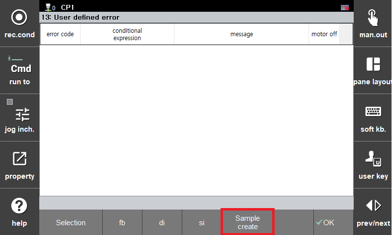
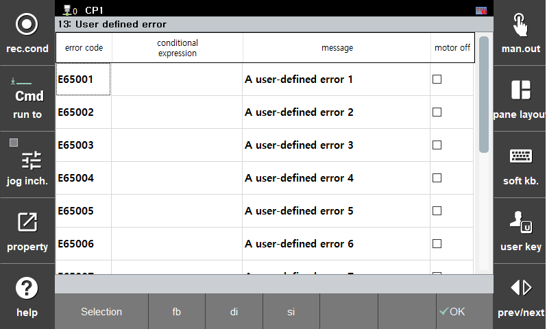
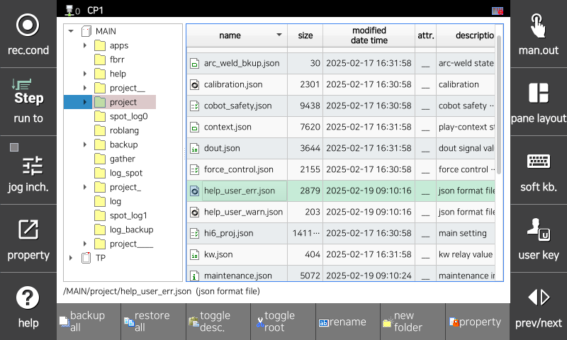
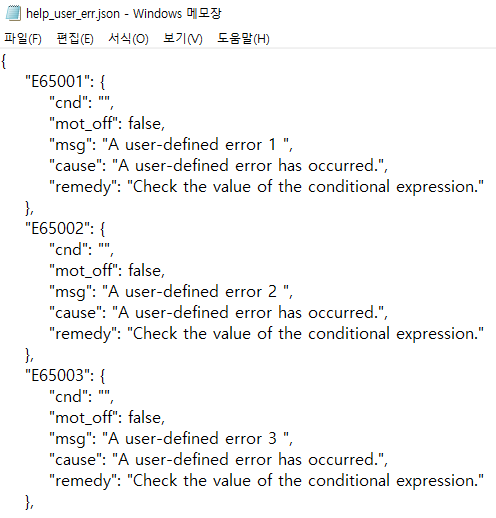

# 7.5.13.1 用户定义错误设置

1. 点击 `[System - 4: Application Parameters - 13: User-Defined Error] ([System  - 4: Application Parameters  - 13: User-Defined Error])` 菜单。  

2. 点击 "创建样本文件" 按钮。 
名为 "help_user_err.json" 的文件将在 MAIN/project 目录中创建。 

3. 重新进入设置屏幕时，样本文件中写入的用户定义错误将显示。 
- 错误代码：指定要触发的错误代码。
- 条件表达式：定义触发错误的条件。可以使用任何可以用于 if 语句的条件表达式。
- 消息：指定发生错误时显示的消息。
- 电机关闭：确定当发生用户定义错误时电机是否应关闭。 

4. 将 USB 驱动器插入教学挂件，访问文件管理器菜单，并将 'help_user_err.json' 文件复制到 USB 存储路径。  

5. 在 PC 上打开文件，并根据样本文件格式编辑错误（使用记事本进行编辑是可能的）。  
- E65###：错误代码（范围：E65001 ~ E65500）
    - cnd：条件表达式
    - msg：在错误帮助中显示的原因消息
    - remedy：在错误帮助中显示的纠正措施
    - mot_off：电机关闭 

6. 将编辑过的文件复制回教学挂件。