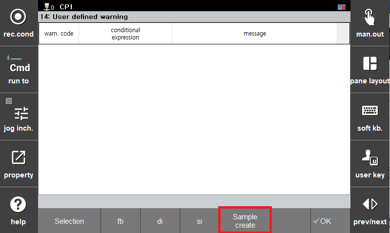
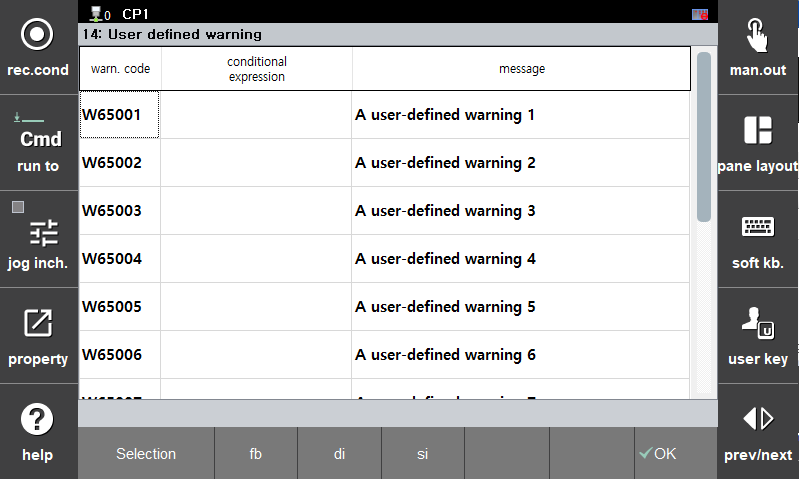
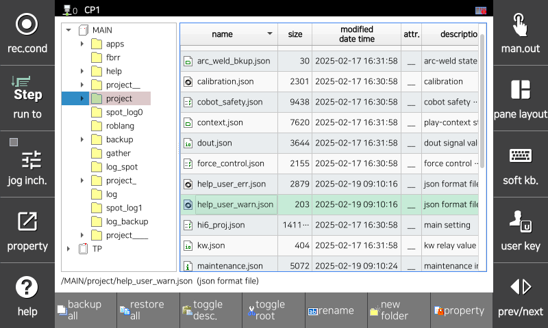
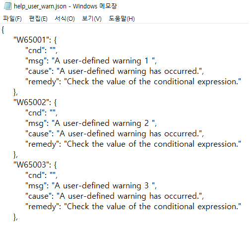

# 7.5.14.1 User-Defined Warning Settings

1. Touch the \[System &gt; 4: Application Parameters &gt; 14: User-Defined Warning\] menu.  

2. Click the 'Create Sample File' button. 
* A file named 'help_user_warn.json' will be created in the MAIN/project directory. 

3. When re-entering the settings screen, the user-defined warnings written in the sample file will be displayed.
- Warning Code: Specifies the warning code to be triggered.
- Condition Expression: Defines the condition for triggering the warning. Any condition expression that can be used in an if statement is allowed.
- Message: Specifies the message displayed when the warning occurs. 

4. Insert a USB drive into the teaching pendant, access the File Manager menu, and copy the 'help_user_warn.json' file to the USB storage path.  

5. Open the file on a PC and edit the warnings according to the sample file format (editing with Notepad is possible).  
- W65###: Warning Code (Range: W65001 ~ W65100)
    - cnd: Condition expression
    - msg: Cause message displayed in the warning help
    - remedy: Corrective action displayed in the warning help 

6. Copy the edited file back to the teaching pendant.