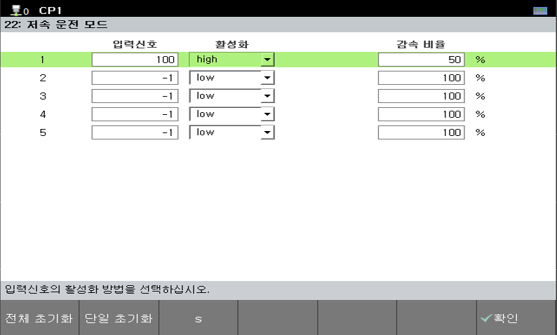

# 7.5.22 减速模式

当输入信号（di）从关闭变为开启时，机器人速度根据设定的减速比率降低。  
在移动命令中，机器人速度通过将原始速度值与自动模式机器人速度和减速比率结合应用。  

  * 输入信号：设置控制器接收到的信号。
  * 激活：
    * 高：当信号处于开启状态时应用减速，信号关闭时取消减速。
    * 低：当信号处于关闭状态时应用减速，信号开启时取消减速。
  * 减速率：  
    * 确定速度将降低的比例。
    * 当收到减速模式输入信号时，机器人速度设置为自动模式机器人速度乘以减速率。


* 在手动模式下不应用减速比率。



* 选择与输入信号状态匹配的正确激活条件。
* 在播放过程中收到I/O信号时，仍然会应用减速模式。
