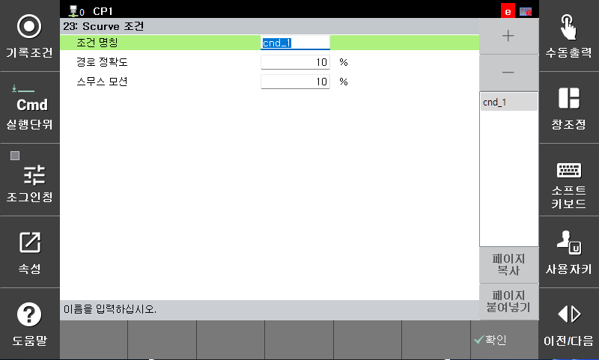

# 7.5.23.1 S-curve condition

S‑curve 条件设置允许您详细定义机器人操作时发生的加速和减速阶段的特性。配置以下项目以匹配每个过程所需的特性（例如路径精度或振动减少）。

  * 状态名称：输入条件的名称。
  * 路径精度  
    决定机器人遵循指定轨迹的忠实度。对于如加工或精密组装等过程，建议使用更高的值，以最小化轨迹偏差。
    较大的值提高路径精度，但也可能导致相对较高的振动。
  * 平稳运动  
    决定加速和减速变化的温和程度。当您需要保护易碎工件（例如玻璃）、过程对振动敏感或希望减少对机器人硬件的机械冲击时，使用更高的值。较大的值产生更平滑的运动，但也会增加周期时间。如果设置的值过高，可能会导致机器人无法执行连续运动，导致其以不连续的方式移动。

## 示例设置

* 精密加工和点胶（路径精度优先）
  * 机器人必须准确地遵循预定轨迹。

  * 推荐设置：
    * 路径精度：高（例如，80 ~ 100）
    * 平稳运动：低到中等（例如，20 ~ 40）

  * 用例：沿汽车零件的复杂曲线涂抹密封剂或进行激光切割。为了最小化轨迹误差，设置高精度；保持路径比轻微振动更重要。

  * 注意：根据实际机器人的振动行为和特定过程规格调整参数。

* 敏感货物运输（振动减少，平稳运动优先）
  * 一个过程，其中振动可能损坏产品或导致错位。

  * 推荐设置：
    * 路径精度：中等（例如，50）
    * 平稳运动：高（例如，80 ~ 100）

  * 用例：运输半导体晶圆、大型玻璃面板（LCD/OLED）或含有易溢液体的容器。在加速/减速期间最小化冲击，以防止滑动或晃动。

  * 注意：由于运动变得更加平滑，整体周期时间（操作时间）可能会增加，或者可能需要执行不连续的运动。