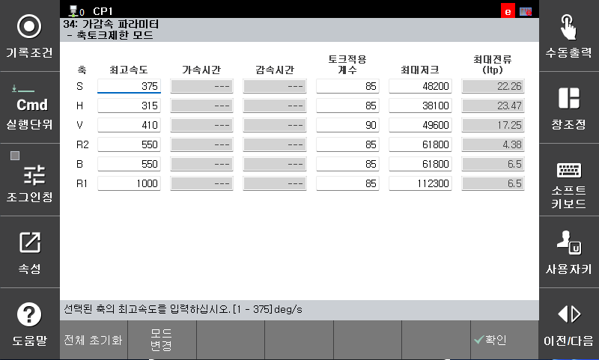

# 7.5.23.2 가감속 파라미터

S-curve 조건과 **최대 저크**는 상호 보완적인 관계에 있습니다. S-curve 설정만으로 공정 최적화가 어려운 경우, 하드웨어 수준의 물리량인 최대 저크 값을 직접 수정하여 모션을 정밀하게 제어할 수 있습니다.

저크(Jerk)와 모션의 관계
저크는 가속도의 변화율을 의미하며, 이 값을 조절함에 따라 다음과 같은 특성 변화가 발생합니다.

최대 저크 값 감소 (↓): 가속도 변화가 더 완만해져 모션이 부드러워지며 진동이 감소합니다. 단, 목표 속도에 도달하는 시간이 길어져 사이클 타임이 증가할 수 있습니다.

최대 저크 값 증가 (↑): 기민한 반응성을 얻을 수 있으나, 값이 너무 크면 S-curve 조건의 '스무스 모션' 설정 효과가 반감되어 기계적 충격이 커질 수 있습니다.

최대 저크 값의 자동 갱신
시스템은 장비의 안정성을 위해 주요 파라미터 변경 시 최대 저크 값을 자동으로 재계산합니다.
- 갱신 조건: 최고 속도 또는 가속 시간 설정 변경 시
- 부가축 적용: 부가축 파라미터 설정에서 해당 축의 최고 속도 또는 가속 시간 사양을 변경하는 경우에도 동일하게 갱신됩니다.


주의: 수동 설정 값 초기화 최고 속도나 가속 시간을 수정하면 수동으로 입력했던 최대 저크 값이 시스템 계산값으로 덮어쓰기(Overwrite) 됩니다. 특정 공정을 위해 저크 값을 최적화한 경우, 변경 전 기존 값을 반드시 백업하시기 바랍니다.



가감속 파라미터 설정은 엔지니어링 모드 이상에서만 활성화 됩니다.

