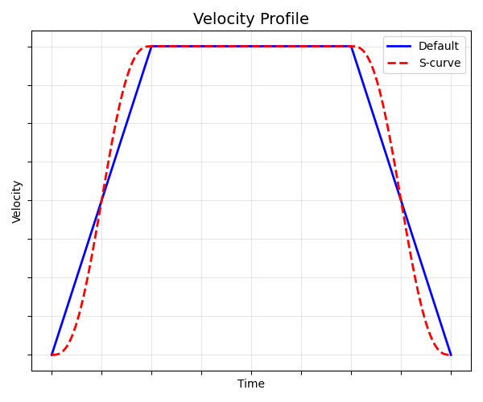

# 7.5.23 S-curve 조건

S-curve는 작업에 따라 경로 정확도, 잔류 진동을 조절하여 최적 공정을 설계하기 위한 모션 궤적 계획을 의미합니다.

본 이미지는 기본 속도 프로파일링 방식과 S-curve 속도 프로파일링 방식을 비교한 그래프입니다.

Default (청색 실선): 가속 시작과 종료 시점에 속도 변화가 급격하여 기계적 충격(Jerk)이 발생할 수 있습니다.

S-curve (적색 점선): 가속 및 감속 시작 구간을 곡선으로 처리하여 속도가 부드럽게 변화합니다. 이를 통해 장비의 진동을 최소화하고 하드웨어의 수명을 연장하며, 고속 구동 시에도 안정적인 경로 정확도를 확보할 수 있습니다.


* 이 기능은 V70.00-00 및 이후 버전부터 지원됩니다.
* 명령어 문법은 ${cont_model} 제어기 기능설명서 "[5.22 scurve문](https://hrbook-hrc.web.app/#/view/doc-hrscript/ko/5-moving-robot/21-shift_lim?cont_model=${cont_model})"를 참조하십시오.

