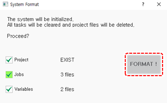

# 7.6.1 系统格式

1. 在${cont_model}示教器屏幕的状态栏上，检查操作模式是否设置为手动模式。

    

    如果设置为自动模式，请将示教器的模式开关切换到手动模式。

    

2. 点击`[system]`按钮 - `[5: 初始化 - 1: 系统格式] ([5: 初始化 - 1: 系统格式])`菜单。

3. 在检查已保存的数据后，点击`[Initialize]`按钮。所有数据和程序，包括控制参数文件和机器参数文件，将被删除，初始设置值将被恢复。

    