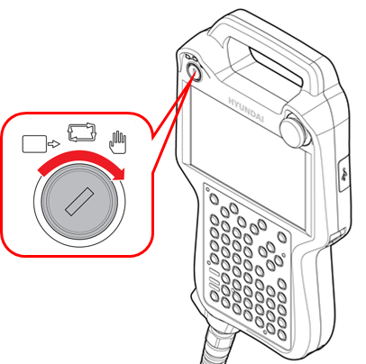
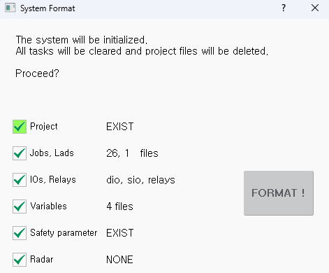

# 7.6.1 System Format

1.	On the status bar of the ${cont_model} teach pendant screen, check if the operation mode is set to manual mode.

    

    If it is set to automatic mode, turn the mode switch of the teach pendant to set it to manual mode.

    

2.	Touch the `[system]` button  - `[5: Initialize  - 1: System format]` menu.

3.	After checking the saved data, touch the `[Initialize]` button. You can delete all configuration files and programs, and restore all data to its initial settings.

    

<table>
  <thead>
    <tr>
      <th style="text-align:left">Item</th>
      <th style="text-align:left">Description</th>
    </tr>
  </thead>
  <tbody>
    <tr>
      <td style="text-align:left">
        Project
      </td>
      <td style="text-align:left">Whether to delete all configuration files. 
      </td>
    </tr>
    <tr>
      <td style="text-align:left">
        Jobs, Lads
      </td>
      <td style="text-align:left">Whether to delete all programs and ladder files.</td>
    </tr>
    <tr>
      <td style="text-align:left">
        IOs, Relays
      </td>
      <td style="text-align:left">Whether to initialize all I/O signals and relay values.</td>
    </tr>
    <tr>
      <td style="text-align:left">
        Variables
      </td>
      <td style="text-align:left">Whether to initialize files created as global variables.
      </td>
    </tr>
    <tr>
      <td style="text-align:left">
        Safety parameter
      </td>
      <td style="text-align:left">Whether to initialize safety parameter settings.
      </td>
    </tr>
    <tr>
      <td style="text-align:left">
        Radar
      </td>
      <td style="text-align:left">Whether to initialize radar configuration settings.
      </td>
    </tr>
  </tbody>
</table>

