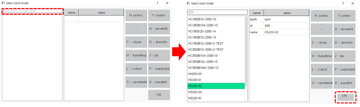
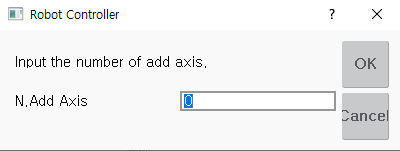
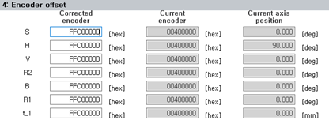

# 7.6.2 Robot Type Selection

1.	Touch the `[5: Initialize  - 2: Robot Type Selection]` menu. Or touch the `[Mechanism]` button at the top right of the ${cont_model} teach pendant screen.

2.	Select a robot in the robot model selection window, and then touch the `[OK]` button.

    

* You can scroll through the robot model list to check the model name, or you can input the model name to search.
* If you touch the robot usage button, only the robots belonging to the usage can be checked on the list.
* 
  If you select a new robot model, the machine parameter file \(hi6\_porj.json\) will be restored to the initial setting values, and various history files will also be initialized.

* 
  If you select a system that includes additional axes such as a travel axis or a servo gun, you should set the number of additional axes. If a system consists of only robot axes without additional axes, input 0. 

  


* The manipulator and controller are shipped as one system. For this reason, the robot controller is equipped with a drive suitable for the drive capacity of the robot that is part of the system.
* When resetting the system by initializing it, you must check the model of the robot that was set to the initial setting values when shipped from the factory, and then set the correct model.





* Le manipulateur et le contrôleur sont livrés en tant qu'un seul système. Le contrôleur est donc équipé d'un variateur adapté à la capacité d'entraînement du robot.
* Après une réinitialisation du système, vérifiez le modèle de robot configuré par défaut en usine, puis sélectionnez le modèle approprié.
  

3.	Enter Engineer Mode. For detailed settings, please refer to "[8.12 Engineer Mode](../../8-r-code/12-r314.md)".

4.	Touch the `[system]` button  - `[3: Robot Parameter  - 4: Encoder Offset]` menu.

5.	Perform encoder offset calibration. To turn on the motor, you should set the encoder offset temporarily even if the robot position is not the reference position.For detailed information, please refer to "[7.4.4 Encoder Offset](../../7-system/4-robot-parameter/4-encoder-offset/README.md)".

    


* You should perform an encoder offset setting normally after moving the robot to the reference position.
* For the initial setting, you should perform the encoder offset setting even if the robot position is not the reference position. Otherwise, the motor will not be turned on, making it impossible to drive the robot.



6.	Turn off and on the power of the controller and then supply power to the motor.

7.	In manual mode, move the robot safely to the reference position at low speed and then perform the encoder offset calibration again by referring to steps 7-8.

* In the encoder offset setting item, the current encoder position will be set to 0X400000 \(hexadecimal\).
* When a motor is replaced because of failure, if the encoder offset setting is performed at the same location, the recorded program can be used identically.

8.	Press the `[Program]` key on the teach pendant, and select the program 9999 and then record one step. You can move the robot to the reference position easily. 


* To initialize the system, contact the customer support team and ask an expert.
* 
  For initialization of a collaborative root, refer to the collaborative robot safety functions manual.

* 
  When the system is initialized, all data and programs, including control parameter files and machine parameter files, will be deleted. If you back up your data before initializing the system, it can be restored and used when necessary.For detailed information on data backup and restore, please refer to ["4.2.5 Data Backup"](../../4-service/2-file-manager/5-data-backup.md) and ["4.2.6 Data Restore"](../../4-service/2-file-manager/6-data-restore.md).




* Pour initialiser le système, contactez le service d'assistance clientèle.
* Pour l'initialisation d'un robot collaboratif, reportez-vous au manuel des fonctions de sécurité du robot collaboratif.
* Lors de l'initialisation du système, toutes les données et tous les programmes, y compris les fichiers de paramètres de commande et les fichiers de paramètres machine, sont supprimés. Il est recommandé d'effectuer une sauvegarde des données avant l'initialisation afin de pouvoir les restaurer si nécessaire. Pour plus d'informations, reportez-vous aux sections « 4.2.5 Sauvegarde des données » et « 4.2.6 Restauration des données ».
  

