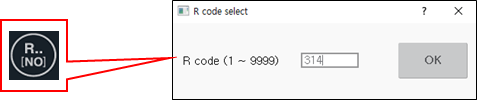

# 7.6.2 机器人类型选择

1. 触摸 `[5: Initialize - 2: Robot Type Selection] ([5: Initialize - 2: Robot Type Selection])` 菜单。或者触摸 ${cont_model} 教学挂件屏幕右上角的 `[Mechanism]` 按钮。

2. 在机器人型号选择窗口中选择一个机器人，然后触摸 `[OK]` 按钮。

    

* 您可以滚动浏览机器人型号列表以检查型号名称，或者可以输入型号名称进行搜索。
* 如果您触摸机器人使用按钮，则仅可在列表中查看属于该用途的机器人。
* 
  如果您选择了一个新机器人型号，机器参数文件 \(hi6\_porj.json\) 将恢复为初始设置值，各种历史文件也将被初始化。

* 
  如果您选择一个包含额外轴（如旅行轴或伺服枪）的系统，则应设定额外轴的数量。如果系统仅由机器人轴组成而没有额外轴，请输入 0。

  


* 操作臂和控制器作为一个系统发货。因此，机器人控制器配备了适合作为系统部分的机器人的驱动能力的驱动器。
* 当通过初始化重置系统时，必须检查出厂时设置为初始设置值的机器人的型号，然后设置正确的型号。



3. 在 ${cont_model} 教学挂件屏幕右下角触摸 `[Favorites]` 按钮，在收藏窗口的输入区域输入 314，然后触摸 `[OK]` 按钮。

    


* 在工程师模式下，工程师模式图标\(\)将在状态栏上闪烁。
* 请注意，如果设置不正确，机器人系统可能会发生严重问题。


4. 触摸 `[system]` 按钮 - `[3: Robot Parameter - 4: Encoder Offset] ([3: Robot Parameter - 4: Encoder Offset])` 菜单。

5. 执行编码器偏移校准。即使机器人位置不是参考位置，也应临时设置编码器偏移以启动车载电机。

    


* 您应在机器人移动到参考位置后正常执行编码器偏移设置。
* 对于初始设置，即使机器人位置不是参考位置，您也应执行编码器偏移设置。否则，电机将无法启动车辆，导致无法驱动机器人。



6. 关闭控制器电源，然后重新开启电源，接着给电机供电。

7. 在手动模式下，以低速安全移动机器人到参考位置，然后根据步骤 7-8 再次执行编码器偏移校准。

* 在编码器偏移设置项中，当前编码器位置将设置为 0X400000 \(十六进制\)。
* 更换电机因为故障时，如果在同一位置执行编码器偏移设置，记录的程序可以完全相同地使用。

8. 按下教学挂件上的 `[Program]` 键，选择程序 9999，然后记录一个步骤。您可以轻松将机器人移动到参考位置。


* 要初始化系统，请联系客户支持团队并寻求专家的帮助。
* 
  有关协作机器人的初始化，请参阅协作机器人安全功能手册。

* 
  当系统初始化时，包括控制参数文件和机器参数文件在内的所有数据和程序将被删除。如果在初始化系统之前备份您的数据，则可以在必要时恢复并使用。
