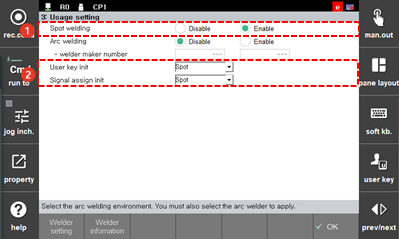

# 7.6.3.1 Spot Welding

If you select the operation usage as spot welding, you can use the commands related to spot welding and access the menu related to spot welding.

1.	Set \[Spot Welding\] as enable. Then, other usages will be handled as disable.

2.	Click the \[User Key Initialization\] drop-down menu and the \[Input/Output Assign Initialization\] drop-down menu, respectively, and select spot.

