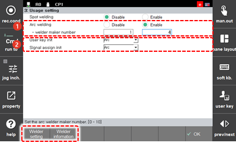

# 7.6.3.2 Arc Welding

If you select the operation usage as Arc welding, you can use commands related to arc welding and access the menus related to arc welding.

1.	Set the welding machine type \(analog or digital\) in \[Arc Welding\]. Other usages will be handled as disable, and a list of welders supported by the system will appear at the bottom of the screen.

2.	After checking the welder list, set the welder number.

3.	Click the \[User Key Initialization\] drop-down menu and the \[Input/Output Assign Initialization\] drop-down menu, respectively, and select arc.

