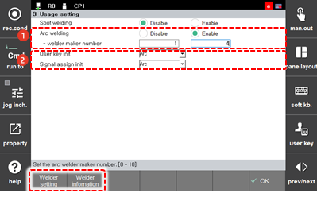

# 7.6.3.2 弧焊 

如果您选择操作用途为弧焊，则可以使用与弧焊相关的命令并访问与弧焊相关的菜单。

1. 在 `[Arc Welding]` 中设置焊接机类型 \(模拟或数字\)。其他用途将被禁用，系统支持的焊机列表将在屏幕底部显示。

2. 检查焊机列表后，设置焊机编号。

3. 点击 `[User Key Initialization]` 下拉菜单和 `[Input/Output Assign Initialization]` 下拉菜单，分别选择弧焊。