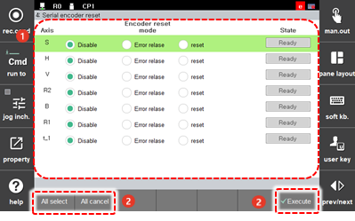

# 7.6.4 Serial Encoder Reset

The serial encoder stores the encoder rotation speed information in the internal memory. The encoder rotation speed can be cleared to zero by resolving the motor error state or by resetting the zero point of the encoder.

1.	Touch the \[5: Initialize &gt; 4: Serial Encoder Reset\] menu.

2.	Set the encoder resetting mode for each axis and check the status, and then execute the resetting.

    

<table>
  <thead>
    <tr>
      <th style="text-align:left">No.</th>
      <th style="text-align:left">Description</th>
    </tr>
  </thead>
  <tbody>
    <tr>
      <td style="text-align:left">
        
      </td>
      <td style="text-align:left">
        
You can set whether to use the encoder reset function for each axis and
          set a mode for each axis.

        <ul>
          <li>[Disable]: Serial encoder resetting will not be executed.</li>
          <li>[Error release]: You can clear only the errors related to the motor encoder
            without clearing the encoder rotation speed.</li>
          <li>[Reset]: You can clear the rotation speed by resolving the errors related
            to the motor encoder and then by resetting the zero point of the encoder.</li>
        </ul>
      </td>
    </tr>
    <tr>
      <td style="text-align:left">
        
      </td>
      <td style="text-align:left">
        <ul>
          <li>[Execute]: You can execute the serial encoder resetting.</li>
          <li>[All select]: You can select all axes at once.</li>
          <li>[All cancel]: You can deselect all axes at once</li>
        </ul>
      </td>
    </tr>
  </tbody>
</table>


* You can perform the encoder resetting when performing the initial setting of the robot system, but never perform the encoder resetting while the robot is operating normally. However, if an encoder-related error such as a communication error occurs or the encoder battery is lost, you can perform the encoder resetting. In this case, check the actual position in the robot program so that it does not differ from the existing robot origin position.
* If the power is not supplied to the controller and encoder, the position information of the encoder may be lost, possibly causing trouble in using the job program of the robot. To solve this problem, a dedicated battery is attached to the serial encoder, making it possible to record the position information regardless of the power status of the controller. If a voltage error occurs in the encoder battery, the battery must be replaced while the controller is still powered on to prevent loss of the position information.


