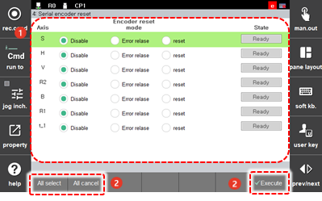

# 7.6.4 串行编码器重置

串行编码器将编码器的旋转速度信息存储在内部内存中。可以通过解除电机错误状态或重置编码器的零点将编码器的旋转速度清除为零。

1. 触摸`[5: 初始化 - 4: 串行编码器重置] ([5: Initialize  - 4: Serial Encoder Reset])`菜单。

2. 为每个轴设置编码器重置模式并检查状态，然后执行重置。

    

<table>
  <thead>
    <tr>
      <th style="text-align:left">编号</th>
      <th style="text-align:left">描述</th>
    </tr>
  </thead>
  <tbody>
    <tr>
      <td style="text-align:left">
        
      </td>
      <td style="text-align:left">
        
您可以设置是否为每个轴使用编码器重置功能并
          为每个轴设置模式。

        <ul>
          <li>[禁用]: 不会执行串行编码器重置。</li>
          <li>[错误释放]: 您可以仅清除与电机编码器相关的错误，而不清除编码器旋转速度。</li>
          <li>[重置]: 您可以通过解除与电机编码器相关的错误，然后重置编码器的零点来清除旋转速度。</li>
        </ul>
      </td>
    </tr>
    <tr>
      <td style="text-align:left">
        
      </td>
      <td style="text-align:left">
        <ul>
          <li>[执行]: 您可以执行串行编码器重置。</li>
          <li>[全选]: 您可以一次性选择所有轴。</li>
          <li>[全部取消]: 您可以一次性取消选择所有轴</li>
        </ul>
      </td>
    </tr>
  </tbody>
</table>


* 在执行机器人系统的初始设置时，您可以进行编码器重置，但切勿在机器人正常操作时执行编码器重置。如果发生与编码器相关的错误，例如通信错误或编码器电池丢失，您可以执行编码器重置。在这种情况下，请在机器人程序中检查实际位置，以确保与现有机器人原点位置没有差异。
* 如果控制器和编码器未供电，编码器的位置信息可能会丢失，从而可能导致使用机器人作业程序时出现问题。为了解决这个问题，串行编码器上配有专用电池，使得无论控制器的电源状态如何都可以记录位置信息。如果在编码器电池中发生电压错误，必须在控制器仍然供电的情况下更换电池，以防止位置信息的丢失。
