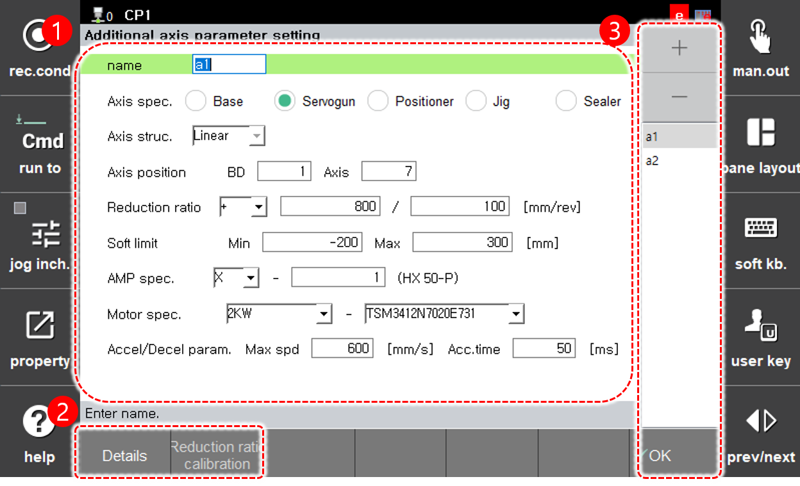

# 7.6.5 额外轴参数设置

除了机器人本身外，可使用的额外轴包括机器人的基轴（移动轴）、伺服枪轴、定位器轴和夹具轴。有关每个额外轴规格的详细信息，请参阅“额外轴功能手册”。

设置所使用的额外轴的规格和配置等参数的方法如下。

1.	触摸 `5: 初始化 - 5: 额外轴参数设置 (5: Initialize - 5: Additional Axis Parameter Setting)` 菜单。

2.	设置额外轴的规格和配置等参数。

    

<table>
  <thead>
    <tr>
      <th style="text-align:left">序号</th>
      <th style="text-align:left">描述</th>
    </tr>
  </thead>
  <tbody>
    <tr>
      <td style="text-align:left">
        
      </td>
      <td style="text-align:left">
        
额外轴的详细参数设置信息。您可以检查并设置额外轴的名称、规格和配置等。

        <ul>
          <li><b>[名称]</b>: 正在使用的额外轴的名称</li>
          <li><b>[轴规格]</b>: 额外轴的规格。您可以根据规格使用单独为每种额外轴用法开发的功能。</li>
          <li><b>[轴结构]</b>: 额外轴的机制类型。在某些轴的规格中，您可以指定提前注册的机制类型。作为示例，您可以在定位情况下选择标准定位器模型。</li>
          <li><b>[轴位置]</b>: 这是轴连接到DSP板的位置。您可以按接线规格顺序指定BD号、DSP号、轴号和刹车号。</li>
          <li><b>[减速比]</b>: 涉及额外轴的电机和连杆的减速比信息
            <ul>
              <li>减速比的符号可以根据当额外轴连杆向（+）方向移动时电机轴的旋转方向进行设置。当从正面查看时，如果轴逆时针旋转，符号将是（+），如果顺时针旋转，符号将是（-）。</li>
              <li>减速比的分子参数是连杆的移动距离（mm或度），分母参数是对应于连杆移动距离的电机转速。设置项的参数将以整数形式定义。对于将以小数显示的参数，请通过将分子和分母乘以某个倍数，将减速比设置为整数。</li>
            </ul>
          </li>
          <li><b>[软限制]</b>: 额外轴的最小和最大操作范围</li>
          <li><b>[AMP规格]</b>: 额外轴的放大器规格</li>
          <li><b>[电机规格]</b>: 连接到额外轴的电机型号</li>
          <li><b>[加速/减速参数]</b>: 额外轴的最大速度和加速时间</li>
        </ul>
      </td>
    </tr>
    <tr>
      <td style="text-align:left">
        
      </td>
      <td style="text-align:left">
        <ul>
          <li><b>[旋转半径]</b>: 您可以添加新的额外轴或删除额外轴。</li>
          <li><b>[减速比校准]</b>: 您可以校准实际轴位置与显示位置之间的差异。</li>
        </ul>
      </td>
    </tr>
    <tr>
      <td style="text-align:left">
        
      </td>
      <td style="text-align:left">
        <ul>
          <li>`[确定]`: 您可以保存更改。</li>
          <li><b>[+]/[-]</b>: 您可以添加新的额外轴或删除额外轴。</li>
        </ul>
      </td>
    </tr>
  </tbody>
</table>