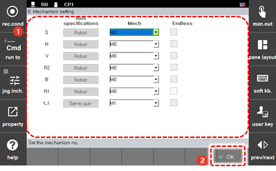

# 7.6.6 机制设置

机制将在 jog 操作期间作为一组使用，jog 键将分配给它。此外，机制也是一组单元，每个单元在记录或编辑步骤位置的过程中要被区分。当机制被设置之后，将为每个轴的单独组分配机制编号 \(M\#\)。

设置无尽功能的方法如下。

1. 触摸 `[5: Initialization - 6: Mechanism Setting] ([5: Initialization  - 6: Mechanism Setting])` 菜单。

2. 在设置机制编号并为每个轴配置无尽功能之后，点击 `[OK]` 按钮。

    

* `[Mech]`: 通过触摸下拉菜单，您可以设置轴的机制编号。
  * 如果轴的规格是机器人，机制编号将固定为 M0。
  * 
    从附加轴开始，您可以将机制编号指定为介于 M1 和 M7 之间的值。

  * 
    设置相同机制编号的轴将作为同一组进行管理。

  * 
    要 jog 附加轴，您可以使用 `[Mech]` 按钮在机制之间切换。在此时，如果您按下 jog 键，将在相关机制的轴的顺序中进行 jog 操作。
* 
  `[Positioner Group]`: 您可以设置定位器组编号。只有在规格设置为定位器的轴上才能设置定位组编号。

* 
  `[Endless]`: 您可以设置是否在轴上使用无尽功能。


集成的机制单元是可以分配给每个任务的最小单元，并且可以驱动。可以将复杂的机制组合分配给各个任务。


#### 

#### 机制 Jog 规则 

* ${cont_model} 控制器提供总共八个 jog 键。
* 
  机制将在 jog 操作期间作为一个组使用。

* 
  如果将机制编号选择为 `[M0]`，则轴 7 和 8 的 jog 键将作为特例操作，并且可以在包括下一个机制的轴总数为八个或更少的范围内操作 M1 和 M2。即使在这种情况下，如果您将机制编号设置为 `[M1]`，您也可以对 M1 的配置元素执行 jog 操作。

* 
  以下显示了用法示例。

  示例 1\) M0: 机器人 \(轴 1-6\)。 M1: 移动轴 \(轴 7\)。 M2: 伺服枪 \(轴 8\)

  * 选择 `[M0]` => 轴 1-6 的 jog 键: M0。 轴 7 的 jog 键: M1。 轴 8 的 jog 键: M2
  * 选择 `[M1]` => 轴 1 的 jog 键: M1
  * 选择 `[M2]` => 轴 1 的 jog 键: M2

  示例 2\) M0: 机器人 \(轴 1-6\)。 M1: 移动轴 \(轴 7\)。 M2: 伺服枪 \(轴 8-9\)

  * 选择 `[M0]` => 轴 1-6 的 jog 键: M0。 轴 7 的 jog 键: M1
  * 选择 `[M1]` => 轴 1 的 jog 键: M1
  * 选择 `[M2]` => 轴 1-2 的 jog 键: M2

  示例 3\) M0: 机器人 \(轴 1-7\)。 M1: 移动轴 \(轴 8\)。 M2: 伺服枪 \(轴 9-10\)

  * 选择 `[M0]` => 轴 1-7 的 jog 键: M0。 轴 8 的 jog 键: M1
  * 选择 `[M1]` => 轴 1 的 jog 键: M1
  * 选择 `[M2]` => 轴 1 的 jog 键: M2