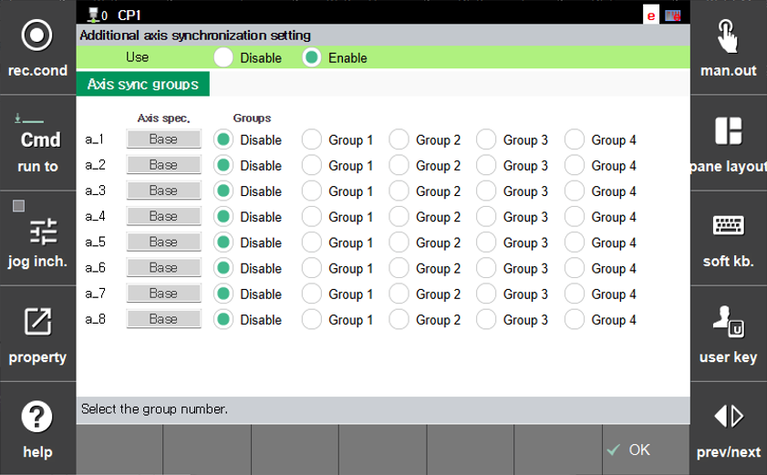

# 7.6.7 Axis Synchronization Function

This function groups two auxiliary axes into a synchronization pair so that they always move to the same position.

When axis synchronization is enabled, the positions of the designated auxiliary axes are always synchronized via software. Therefore, the auxiliary axes to be synchronized must be physically aligned, and axis origin must be set so that they are recognized as the same position by the software. In addition, the physical movement directions of the axes to be synchronized must be set to be the same.

Axis synchronization supports position synchronization between up to 4 pairs of auxiliary axes. When two auxiliary axes are assigned to the same group, they are treated as one synchronization pair.

The procedure to change the currently configured axis synchronization pair is as follows.

1. If the R321 Synchronized group jogging function is enabled, set all of them to `Disable`.

2. Select Engineer Mode (R314), then navigate to `[F2: system] - 5. Initialization - 8. Additional Axis synchronization setting`

3. To enable the axis synchronization function, change `Use` from `Disable` to `Enable`.

4. Assign the 2 auxiliary axes to be treated as one axis to the same group.

5. After completing the group assignment, press the `[F7: OK]` button.


* After completing axis synchronization settings, when Motor ON is activated, the group pair will align to the midpoint. Wait until alignment is completed.
* Once axis synchronization is enabled, individual axes cannot be moved independently, and jog keys are assigned as a single axis.
* This function also applies when executing Job files, not only during jog operations.
* Axis synchronization group pairs are retained even after reboot.
* If `Use` is set to `Disable`, the axis synchronization function will not be activated.
* The Cartesian coordinate Pose values of synchronized axis groups match the actual robot pose.
* If position errors occur between synchronized axes due to emergency stop, servo error, or other factors, the axes will move to the midpoint and realign when Motor ON is activated.



* Before use, ensure that motor specifications and auxiliary axis parameters are properly matched for synchronization (same axis specifications, configuration, speed, and acceleration time).
* If the axis synchronization function is not used, set `Use` to `Disable` and reset the group pairs to `Disable`.
* Do not use this function together with the Synchronized group jogging function.
* Verify that the step pose values in the Job file are implemented with axis synchronization in mind.
* Be aware that changing settings during axis synchronization operation will affect the Cartesian coordinate system.
* Verify that the Synchronized axes are on the same board.

