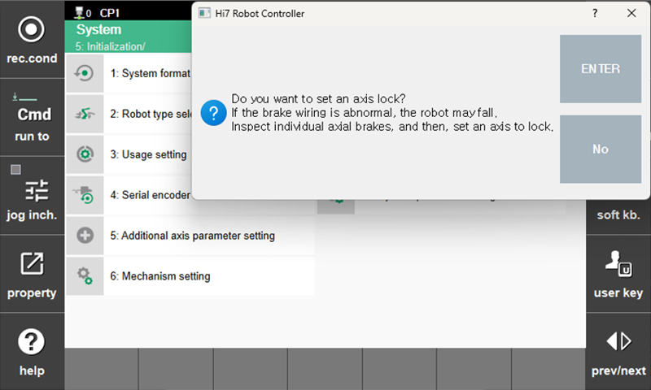
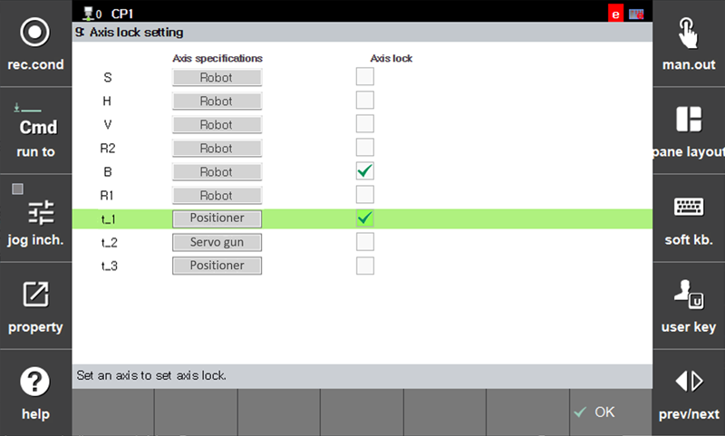

# 7.6.8.1 How to Configure the Function

### Menu Access

Select the menu by navigating to `[F2: system] - 5: Initialization - 9: Axis lock setting`. When entering the menu, you will be prompted to confirm whether each axis brake is functioning normally, as shown below.


Since the robot may fall if the brake wiring is abnormal, please ensure that the brake wiring of each axis is normal before configuring the axis locking function.


### Function Configuration

After confirming that the brake wiring is normal and entering the menu, the specifications of each axis and the axis lock setting status will be displayed as shown below. Select the axis to which you want to apply axis lock, then press `[OK]` to exit the menu.

