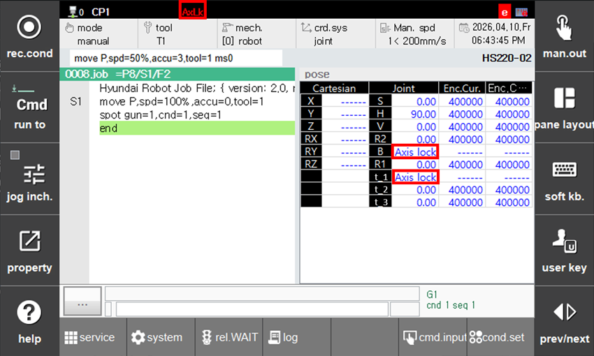
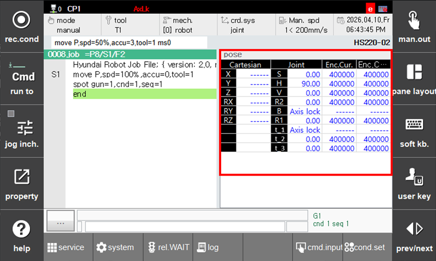
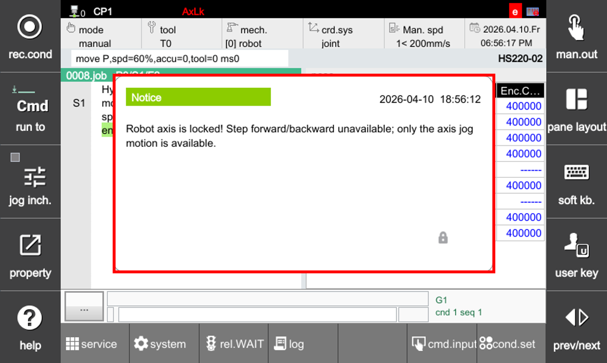

# 7.6.8.2 Checking Function Application

When the axis lock function is applied, robot motion may differ from normal operation due to the locked axis. Therefore, always verify whether axis lock is active before operating the robot.

You can check whether the function is applied through the status bar, warning message, and monitoring display status.

### Status Display Window

The status display window show various conditions required for robot operation.


While using the axis lock function, be sure to check the corresponding indicators before operating the robot.



Lors de l'utilisation de la fonction de verrouillage des axes, vérifiez toujours les indicateurs correspondants avant de faire fonctionner le robot.


-   Status display window: AxLk
-   Right matrix: "Axis lock"

### Monitor Window

During monitoring, the axis data will show an "Axis lock" message for any axis where the function is applied. If a robot axis or base axis is locked, the coordinate values cannot be displayed. In this case, the Cartesian coordinates and the values of the locked axis will be shown as '------'.

### Warning Message

When switching screens or modes, the range of functions corresponding to the locked axis is displayed as a warning message. Through this message, you can always be aware of whether the axis lock function is applied and its range.

