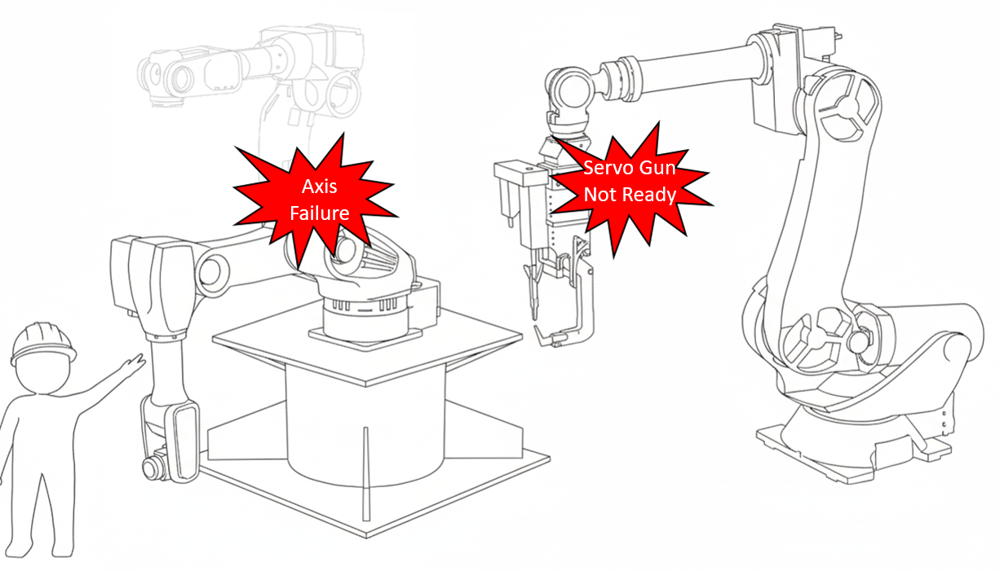

# 7.6.8 Axis Lock

### Purpose of the Function

The purpose of the axis lock function is to temporarily disable a specific axis when repair or replacement is required due to issues with the motor, reducer, or other components of the robot or auxiliary axes. This allows the remaining normal axes to continue operating. By allowing the operation of normal axes, this function improve the convenience of robot maintenance and availability, and to minimize line productivity losses for certain robots.

 

### Scope of the Function

The scope of functionality provided depends on the type of robot and the axis to which the Axis Lock function is applied, as shown in the table below.

|Robot|Axis Lock|Motor ON|JOG(Axis)|JOG(Cartesian)|Step Recording|Command Recording|Command Execution|Step FWD/BWD|Auto Operation|
|:---:|:---:|:---:|:---:|:---:|:---:|:---:|:---:|:---:|:---:|
|All Robots|Robot Axis|o|o|x|x|o|x|x|x|
|All Robots|Auxiliary Axis|o|o|o|o|o|x|o|x|
|*Exception Robots|Specific Axis|o|o|o|o|o|o|o|o|

- *Specific axes for exception robots:
    -	S axis of HH140G-0A
    -	L and R axes of LCD robots
    -	LA and RA axes of LCD 2-DOF arm robots

 


-   This function is available only when the Engineer Code (R314) is entered.
-   Playback in Auto Mode is not available when this function is enabled.
-   When the function is applied, the corresponding axis operates in a locked state.


