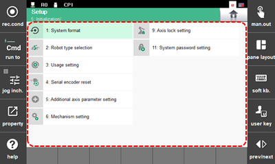

# 7.6 初始化

如果机器人控制器无法正常运行，请初始化系统。系统初始化必须由具有 HD Hyundai Robotics 机器人初始设置经验的工程师执行。

1. 触摸 `[5: 初始化]` 菜单。然后，初始化菜单将出现。

2. 选择所需的菜单，然后执行机器人系统的初始设置，然后初始化串行编码器。

    


在 `[初始化]` 菜单中的某些项目仅在选择特定类型的附加轴时支持。



* 要初始化系统，您应联系客户支持团队并请求专家或合格的工程师以防止错误操作。
* 
  当系统初始化时，控制器中保存的所有数据和程序将被删除。在初始化系统之前，您应备份您的数据和程序，并在必要时恢复它们。

  有关数据备份和恢复的详细信息，请参阅 "[4.2.5 数据备份](../../4-service/2-file-manager/5-data-backup.md)" 和 "[4.2.6 数据恢复](../../4-service/2-file-manager/6-data-restore.md)"。
