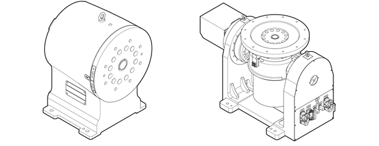

# 7.7.2 位置器校准

位置器校准是一项功能，使机器人能够与安装在机器人外部的夹具设备的操作进行同步跟随，或相对于夹具设备执行线性或圆形操作。将在位置器校准功能应用于的外部夹具设备称为位置器或工作站。

使用位置器校准功能可以补偿由于机器人操作区域的限制而导致的操作困难。换句话说，即使位置器在工件固定在其上的情况下移动，机器人仍然可以通过跟随位置器的移动在工件上执行线性或圆形操作。

您可以通过教学1轴位置器的三个点或2轴位置器的五个点来简单地设置位置器的坐标系统。

位置器校准的主要功能信息如下。

| 主要功能 | 描述 |
| :--- | :--- |
| 位置器组 | 支持1-4个组 |
| 位置器轴计数 | 支持1轴位置器和2轴位置器 \(旋转轴\) |
| 插值模式 | 支持线性插值和圆形插值 |


* 位置器校准功能可以在设置好位置器组的情况下使用。
* 有关更多详细信息，请参阅"[${cont_model} 控制器位置器同步功能手册](https://hrbook-hrc.web.app/#/view/doc-positioner-sync/zh/README)"。
